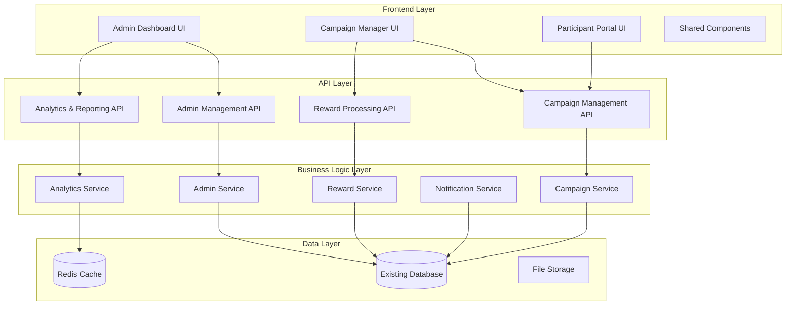

# Design Document

## Overview

This design document outlines the comprehensive completion of the admin system management functionality and survey campaigns feature for the NCSKIT platform. The design builds upon the existing Django backend with React/Next.js frontend, extending the current admin panel infrastructure and survey campaign models to provide a complete, production-ready system.

The solution follows a modular architecture with clear separation of concerns, leveraging the existing authentication system, database models, and component structure while adding new functionality for comprehensive admin management and automated survey campaign workflows.

## Architecture

### System Architecture Overview



### Technology Stack Integration

- **Frontend**: React/Next.js 14 with TypeScript (existing)
- **Backend**: Django REST Framework (existing)
- **Database**: PostgreSQL with existing schema extensions
- **Cache**: Redis for analytics and session management
- **Authentication**: JWT-based system (existing)
- **UI Components**: Tailwind CSS with Heroicons (existing)

## Components and Interfaces

### 1. Admin Management System

#### Admin Dashboard Component
```typescript
interface AdminDashboardProps {
  user: AdminUser
  systemMetrics: SystemMetrics
  recentActivities: AdminActivity[]
}

interface SystemMetrics {
  userCount: number
  activeCampaigns: number
  totalRevenue: number
  systemHealth: {
    database: 'healthy' | 'warning' | 'error'
    api: 'healthy' | 'warning' | 'error'
    storage: 'healthy' | 'warning' | 'error'
    cache: 'healthy' | 'warning' | 'error'
  }
}
```

#### User Management Interface
```typescript
interface UserManagementProps {
  users: User[]
  pagination: PaginationInfo
  filters: UserFilters
  onUserAction: (userId: string, action: UserAction) => void
}

interface UserAction {
  type: 'suspend' | 'activate' | 'delete' | 'changeRole'
  payload?: any
}
```

#### System Configuration Interface
```typescript
interface SystemConfigProps {
  config: SystemConfiguration
  onConfigUpdate: (config: Partial<SystemConfiguration>) => void
}

interface SystemConfiguration {
  adminFeePercentage: number
  maxCampaignDuration: number
  minRewardAmount: number
  emailNotifications: boolean
  maintenanceMode: boolean
}
```

### 2. Survey Campaign Management System

#### Campaign Builder Component
```typescript
interface CampaignBuilderProps {
  questionBank: QuestionTemplate[]
  onCampaignCreate: (campaign: CampaignData) => void
  templates: CampaignTemplate[]
}

interface CampaignData {
  title: string
  description: string
  targetParticipants: number
  rewardPerParticipant: number
  durationDays: number
  surveyConfig: SurveyConfiguration
  eligibilityCriteria: EligibilityCriteria
}
```

#### Campaign Management Interface
```typescript
interface CampaignManagerProps {
  campaigns: SurveyCampaign[]
  onCampaignAction: (campaignId: string, action: CampaignAction) => void
  analytics: CampaignAnalytics
}

interface CampaignAction {
  type: 'launch' | 'pause' | 'resume' | 'complete' | 'cancel'
  payload?: any
}
```

#### Participant Portal Interface
```typescript
interface ParticipantPortalProps {
  availableCampaigns: AvailableCampaign[]
  participationHistory: ParticipationRecord[]
  rewardBalance: number
  onJoinCampaign: (campaignId: string) => void
}

interface AvailableCampaign {
  id: string
  title: string
  description: string
  reward: number
  estimatedTime: number
  eligibilityMatch: boolean
}
```

### 3. Reward Processing System

#### Reward Management Interface
```typescript
interface RewardManagerProps {
  pendingRewards: CampaignReward[]
  processedRewards: CampaignReward[]
  onProcessReward: (rewardId: string) => void
  onBulkProcess: (rewardIds: string[]) => void
}

interface RewardProcessingResult {
  success: boolean
  transactionId?: string
  errorMessage?: string
  processedAt: Date
}
```

### 4. Brand Management System

#### Brand Configuration Interface
```typescript
interface BrandManagementProps {
  brandConfig: BrandConfiguration
  onBrandUpdate: (config: Partial<BrandConfiguration>) => void
  onLogoUpload: (file: File, type: LogoType) => void
  onPreview: () => void
}

interface BrandConfiguration {
  platformTitle: string
  platformTagline: string
  metaDescription: string
  headerLogo: string
  favicon: string
  mobileIcon: string
  colorScheme: {
    primary: string
    secondary: string
    accent: string
    background: string
  }
  theme: 'light' | 'dark' | 'auto'
  customCSS?: string
}

interface LogoType {
  type: 'header' | 'favicon' | 'mobile' | 'email'
  dimensions: { width: number; height: number }
  formats: string[]
}
```

#### Interface Customization Component
```typescript
interface InterfaceCustomizationProps {
  currentTheme: ThemeConfiguration
  availableThemes: ThemeTemplate[]
  onThemeChange: (theme: ThemeConfiguration) => void
  onCustomCSS: (css: string) => void
}

interface ThemeConfiguration {
  name: string
  colors: ColorPalette
  typography: TypographySettings
  layout: LayoutSettings
  components: ComponentStyles
}
```

### 5. Advanced User Management System

#### User Role Management Interface
```typescript
interface UserRoleManagementProps {
  roles: UserRole[]
  permissions: Permission[]
  onRoleCreate: (role: CreateRoleData) => void
  onRoleUpdate: (roleId: string, updates: Partial<UserRole>) => void
  onRoleDelete: (roleId: string) => void
}

interface UserRole {
  id: string
  name: string
  description: string
  permissions: string[]
  isSystem: boolean
  userCount: number
  createdAt: Date
  updatedAt: Date
}

interface Permission {
  id: string
  name: string
  description: string
  category: string
  isSystem: boolean
}
```

#### Advanced User Profile Management
```typescript
interface UserProfileManagementProps {
  user: ExtendedUser
  availableRoles: UserRole[]
  onProfileUpdate: (userId: string, updates: UserProfileUpdate) => void
  onRoleChange: (userId: string, roleIds: string[]) => void
  onImpersonate: (userId: string) => void
}

interface ExtendedUser {
  id: string
  email: string
  profile: UserProfile
  roles: UserRole[]
  permissions: string[]
  activityLog: UserActivity[]
  loginHistory: LoginRecord[]
  accountStatus: 'active' | 'suspended' | 'pending' | 'deactivated'
  lastLogin: Date
  createdAt: Date
}

interface UserProfile {
  firstName: string
  lastName: string
  displayName: string
  avatar: string
  phone: string
  address: Address
  preferences: UserPreferences
  metadata: Record<string, any>
}
```

## Data Models

### Extended Database Schema

#### Admin Activity Tracking
```sql
CREATE TABLE admin_activities (
    id UUID PRIMARY KEY DEFAULT gen_random_uuid(),
    admin_user_id UUID REFERENCES users(id),
    action_type VARCHAR(100) NOT NULL,
    target_type VARCHAR(100),
    target_id VARCHAR(255),
    details JSONB DEFAULT '{}',
    ip_address INET,
    user_agent TEXT,
    created_at TIMESTAMP DEFAULT NOW()
);

CREATE INDEX idx_admin_activities_user ON admin_activities(admin_user_id);
CREATE INDEX idx_admin_activities_type ON admin_activities(action_type);
CREATE INDEX idx_admin_activities_created ON admin_activities(created_at);
```

#### System Configuration
```sql
CREATE TABLE system_configurations (
    id UUID PRIMARY KEY DEFAULT gen_random_uuid(),
    key VARCHAR(255) UNIQUE NOT NULL,
    value JSONB NOT NULL,
    description TEXT,
    is_active BOOLEAN DEFAULT true,
    created_by UUID REFERENCES users(id),
    created_at TIMESTAMP DEFAULT NOW(),
    updated_at TIMESTAMP DEFAULT NOW()
);
```

#### Brand Configuration
```sql
CREATE TABLE brand_configurations (
    id UUID PRIMARY KEY DEFAULT gen_random_uuid(),
    platform_title VARCHAR(255) NOT NULL,
    platform_tagline TEXT,
    meta_description TEXT,
    header_logo_url VARCHAR(500),
    favicon_url VARCHAR(500),
    mobile_icon_url VARCHAR(500),
    color_scheme JSONB DEFAULT '{}',
    theme VARCHAR(50) DEFAULT 'light',
    custom_css TEXT,
    is_active BOOLEAN DEFAULT true,
    created_by UUID REFERENCES users(id),
    created_at TIMESTAMP DEFAULT NOW(),
    updated_at TIMESTAMP DEFAULT NOW()
);

CREATE INDEX idx_brand_config_active ON brand_configurations(is_active);
```

#### User Roles and Permissions
```sql
CREATE TABLE user_roles (
    id UUID PRIMARY KEY DEFAULT gen_random_uuid(),
    name VARCHAR(100) UNIQUE NOT NULL,
    description TEXT,
    permissions JSONB DEFAULT '[]',
    is_system BOOLEAN DEFAULT false,
    created_by UUID REFERENCES users(id),
    created_at TIMESTAMP DEFAULT NOW(),
    updated_at TIMESTAMP DEFAULT NOW()
);

CREATE TABLE permissions (
    id UUID PRIMARY KEY DEFAULT gen_random_uuid(),
    name VARCHAR(100) UNIQUE NOT NULL,
    description TEXT,
    category VARCHAR(100),
    is_system BOOLEAN DEFAULT true,
    created_at TIMESTAMP DEFAULT NOW()
);

CREATE TABLE user_role_assignments (
    id UUID PRIMARY KEY DEFAULT gen_random_uuid(),
    user_id UUID REFERENCES users(id),
    role_id UUID REFERENCES user_roles(id),
    assigned_by UUID REFERENCES users(id),
    assigned_at TIMESTAMP DEFAULT NOW(),
    UNIQUE(user_id, role_id)
);

CREATE INDEX idx_user_roles_name ON user_roles(name);
CREATE INDEX idx_permissions_category ON permissions(category);
CREATE INDEX idx_role_assignments_user ON user_role_assignments(user_id);
```

#### Extended User Profiles
```sql
CREATE TABLE user_profiles (
    id UUID PRIMARY KEY DEFAULT gen_random_uuid(),
    user_id UUID UNIQUE REFERENCES users(id),
    first_name VARCHAR(100),
    last_name VARCHAR(100),
    display_name VARCHAR(200),
    avatar_url VARCHAR(500),
    phone VARCHAR(20),
    address JSONB DEFAULT '{}',
    preferences JSONB DEFAULT '{}',
    metadata JSONB DEFAULT '{}',
    created_at TIMESTAMP DEFAULT NOW(),
    updated_at TIMESTAMP DEFAULT NOW()
);

CREATE TABLE user_login_history (
    id UUID PRIMARY KEY DEFAULT gen_random_uuid(),
    user_id UUID REFERENCES users(id),
    ip_address INET,
    user_agent TEXT,
    login_at TIMESTAMP DEFAULT NOW(),
    logout_at TIMESTAMP,
    session_duration INTEGER,
    is_successful BOOLEAN DEFAULT true
);

CREATE INDEX idx_user_profiles_user ON user_profiles(user_id);
CREATE INDEX idx_login_history_user ON user_login_history(user_id);
CREATE INDEX idx_login_history_date ON user_login_history(login_at);
    created_at TIMESTAMP DEFAULT NOW(),
    updated_at TIMESTAMP DEFAULT NOW()
);
```

#### Campaign Templates
```sql
CREATE TABLE campaign_templates (
    id UUID PRIMARY KEY DEFAULT gen_random_uuid(),
    name VARCHAR(255) NOT NULL,
    description TEXT,
    survey_config JSONB NOT NULL,
    default_settings JSONB DEFAULT '{}',
    category VARCHAR(100),
    is_public BOOLEAN DEFAULT false,
    created_by UUID REFERENCES users(id),
    usage_count INTEGER DEFAULT 0,
    created_at TIMESTAMP DEFAULT NOW()
);
```

#### Notification System
```sql
CREATE TABLE notifications (
    id UUID PRIMARY KEY DEFAULT gen_random_uuid(),
    recipient_id UUID REFERENCES users(id),
    type VARCHAR(100) NOT NULL,
    title VARCHAR(255) NOT NULL,
    message TEXT NOT NULL,
    data JSONB DEFAULT '{}',
    is_read BOOLEAN DEFAULT false,
    sent_at TIMESTAMP DEFAULT NOW(),
    read_at TIMESTAMP
);

CREATE INDEX idx_notifications_recipient ON notifications(recipient_id);
CREATE INDEX idx_notifications_type ON notifications(type);
CREATE INDEX idx_notifications_sent ON notifications(sent_at);
```

### API Data Transfer Objects

#### Campaign Creation DTO
```typescript
interface CreateCampaignDTO {
  title: string
  description: string
  targetParticipants: number
  rewardPerParticipant: number
  durationDays: number
  surveyConfig: {
    questions: QuestionConfig[]
    settings: SurveySettings
  }
  eligibilityCriteria: {
    minAge?: number
    maxAge?: number
    location?: string[]
    demographics?: Record<string, any>
  }
}
```

#### Analytics Response DTO
```typescript
interface CampaignAnalyticsDTO {
  campaignId: string
  metrics: {
    totalParticipants: number
    completedResponses: number
    completionRate: number
    averageCompletionTime: number
    rewardDistribution: {
      pending: number
      processed: number
      failed: number
    }
  }
  demographics: {
    ageDistribution: Record<string, number>
    locationDistribution: Record<string, number>
  }
  timeline: {
    date: string
    participants: number
    completions: number
  }[]
}
```

## Error Handling

### Error Classification System

```typescript
enum ErrorType {
  VALIDATION_ERROR = 'VALIDATION_ERROR',
  AUTHORIZATION_ERROR = 'AUTHORIZATION_ERROR',
  BUSINESS_LOGIC_ERROR = 'BUSINESS_LOGIC_ERROR',
  SYSTEM_ERROR = 'SYSTEM_ERROR',
  EXTERNAL_SERVICE_ERROR = 'EXTERNAL_SERVICE_ERROR'
}

interface ErrorResponse {
  type: ErrorType
  code: string
  message: string
  details?: Record<string, any>
  timestamp: string
  requestId: string
}
```

### Campaign-Specific Error Handling

```typescript
class CampaignError extends Error {
  constructor(
    public code: string,
    public message: string,
    public campaignId?: string,
    public details?: any
  ) {
    super(message)
  }
}

// Error scenarios
const CAMPAIGN_ERRORS = {
  INVALID_STATUS_TRANSITION: 'Cannot transition from current status',
  INSUFFICIENT_PARTICIPANTS: 'Not enough participants to launch',
  REWARD_PROCESSING_FAILED: 'Failed to process participant rewards',
  SURVEY_VALIDATION_FAILED: 'Survey configuration is invalid'
}
```

### Admin Action Error Handling

```typescript
interface AdminActionResult {
  success: boolean
  message: string
  data?: any
  errors?: ValidationError[]
}

interface ValidationError {
  field: string
  message: string
  code: string
}
```

## Testing Strategy

### Unit Testing Approach

#### Backend Testing
```python
# Test campaign lifecycle management
class CampaignLifecycleTestCase(TestCase):
    def setUp(self):
        self.admin_user = User.objects.create_user(
            email='admin@test.com',
            password='test123',
            is_staff=True
        )
        self.campaign = SurveyCampaign.objects.create(
            title='Test Campaign',
            creator=self.admin_user,
            target_participants=100,
            reward_per_participant=10.00
        )
    
    def test_campaign_launch_validation(self):
        # Test campaign can only be launched from draft status
        response = self.client.post(f'/api/campaigns/{self.campaign.id}/launch/')
        self.assertEqual(response.status_code, 200)
        
        # Test cannot launch already active campaign
        response = self.client.post(f'/api/campaigns/{self.campaign.id}/launch/')
        self.assertEqual(response.status_code, 400)
    
    def test_reward_calculation(self):
        # Test admin fee calculation
        fee_percentage = AdminFeeConfiguration.get_current_fee_percentage()
        expected_fee = self.campaign.reward_per_participant * (fee_percentage / 100)
        
        participant = CampaignParticipant.objects.create(
            campaign=self.campaign,
            participant=self.admin_user,
            status='completed'
        )
        
        reward = CampaignReward.objects.create(
            campaign=self.campaign,
            participant=self.admin_user,
            reward_amount=self.campaign.reward_per_participant
        )
        
        self.assertEqual(reward.admin_fee, expected_fee)
```

#### Frontend Testing
```typescript
// Test admin dashboard functionality
describe('AdminDashboard', () => {
  const mockUser = {
    id: '1',
    email: 'admin@test.com',
    role: 'admin',
    profile: { firstName: 'Admin' }
  }
  
  const mockMetrics = {
    userCount: 150,
    activeCampaigns: 5,
    totalRevenue: 5000,
    systemHealth: {
      database: 'healthy' as const,
      api: 'healthy' as const,
      storage: 'healthy' as const,
      cache: 'healthy' as const
    }
  }
  
  it('should display system metrics correctly', () => {
    render(<AdminDashboard user={mockUser} systemMetrics={mockMetrics} />)
    
    expect(screen.getByText('150')).toBeInTheDocument()
    expect(screen.getByText('5')).toBeInTheDocument()
    expect(screen.getByText('5000')).toBeInTheDocument()
  })
  
  it('should show admin features grid', () => {
    render(<AdminDashboard user={mockUser} systemMetrics={mockMetrics} />)
    
    expect(screen.getByText('Quản lý người dùng')).toBeInTheDocument()
    expect(screen.getByText('Cấu hình hệ thống')).toBeInTheDocument()
    expect(screen.getByText('Thống kê & Báo cáo')).toBeInTheDocument()
  })
})
```

### Integration Testing

#### Campaign Workflow Testing
```typescript
describe('Campaign Integration Tests', () => {
  it('should complete full campaign lifecycle', async () => {
    // Create campaign
    const campaign = await createCampaign({
      title: 'Integration Test Campaign',
      targetParticipants: 10,
      rewardPerParticipant: 5.00
    })
    
    // Launch campaign
    await launchCampaign(campaign.id)
    expect(campaign.status).toBe('active')
    
    // Add participants
    const participants = await addParticipants(campaign.id, 10)
    expect(participants.length).toBe(10)
    
    // Complete surveys
    await completeAllSurveys(campaign.id)
    
    // Complete campaign
    await completeCampaign(campaign.id)
    
    // Verify rewards processed
    const rewards = await getProcessedRewards(campaign.id)
    expect(rewards.length).toBe(10)
    expect(rewards.every(r => r.status === 'completed')).toBe(true)
  })
})
```

### End-to-End Testing

#### Admin Workflow E2E Tests
```typescript
describe('Admin E2E Tests', () => {
  it('should allow admin to manage users', async () => {
    await page.goto('/login')
    await page.fill('[data-testid="email"]', 'admin@ncskit.com')
    await page.fill('[data-testid="password"]', 'admin123')
    await page.click('[data-testid="login-button"]')
    
    await page.goto('/admin/users')
    await page.waitForSelector('[data-testid="users-table"]')
    
    // Test user suspension
    await page.click('[data-testid="suspend-user-1"]')
    await page.click('[data-testid="confirm-suspend"]')
    
    await expect(page.locator('[data-testid="user-1-status"]')).toHaveText('Suspended')
  })
})
```

### Performance Testing

#### Load Testing Scenarios
```typescript
// Campaign creation load test
const campaignCreationTest = {
  name: 'Campaign Creation Load Test',
  scenarios: {
    concurrent_creation: {
      executor: 'ramping-vus',
      startVUs: 1,
      stages: [
        { duration: '2m', target: 10 },
        { duration: '5m', target: 50 },
        { duration: '2m', target: 0 }
      ]
    }
  },
  thresholds: {
    http_req_duration: ['p(95)<2000'], // 95% of requests under 2s
    http_req_failed: ['rate<0.1']      // Error rate under 10%
  }
}
```

## Implementation Phases

### Phase 1: Admin System Enhancement (Week 1-2)
- Extend existing admin panel with comprehensive user management
- Implement system configuration management
- Add admin activity logging and audit trails
- Create analytics dashboard for system metrics

### Phase 2: Campaign Management System (Week 3-4)
- Build campaign creation wizard with question bank integration
- Implement campaign lifecycle management (launch, pause, resume, complete)
- Create campaign analytics and reporting
- Add campaign templates and reusable configurations

### Phase 3: Participant Experience (Week 5)
- Develop participant portal for campaign discovery
- Implement survey completion workflow with progress tracking
- Create reward tracking and transaction history
- Add notification system for campaign updates

### Phase 4: Reward Processing Automation (Week 6)
- Implement automated reward calculation and distribution
- Create admin controls for reward processing and approval
- Add financial reporting and revenue analytics
- Implement dispute resolution workflow

### Phase 5: Testing and Optimization (Week 7-8)
- Comprehensive testing suite implementation
- Performance optimization and caching
- Security audit and penetration testing
- Documentation and deployment preparation

## Security Considerations

### Authentication and Authorization
- Role-based access control with granular permissions
- JWT token validation with refresh token rotation
- Admin action logging with IP tracking and user agent recording
- Multi-factor authentication for admin accounts

### Data Protection
- Input validation and sanitization for all user inputs
- SQL injection prevention through parameterized queries
- XSS protection with Content Security Policy headers
- CSRF protection for state-changing operations

### Campaign Security
- Participant eligibility validation to prevent fraud
- Survey response integrity checks
- Reward processing with transaction logging
- Admin approval workflow for high-value rewards

This design provides a comprehensive foundation for implementing the complete admin system management and survey campaigns functionality while maintaining security, performance, and scalability requirements.