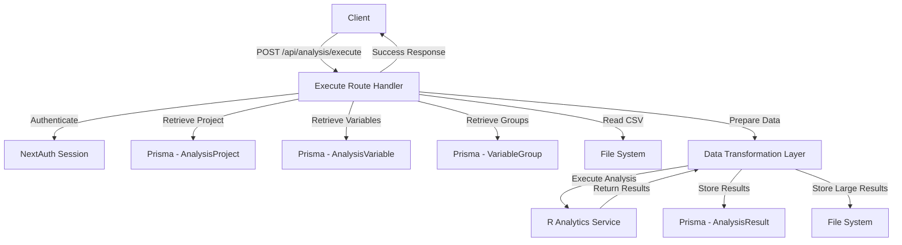

# Design Document

## Overview

This design document outlines the migration of the `/api/analysis/execute` endpoint from Supabase to Prisma ORM. The migration will enable researchers to execute statistical analyses on their CSV data by integrating with the R Analytics service while maintaining consistency with other migrated endpoints (upload, variables, group).

The execute endpoint is the most complex analysis route, requiring coordination between:
- Database operations for retrieving project data, variables, and groups
- CSV file reading from the file system
- Data transformation for R service compatibility
- R service communication for statistical analysis execution
- Result storage in both database and file system

## Architecture

### High-Level Flow

```
User Request → Authentication → Data Retrieval → Data Preparation → R Service Execution → Result Storage → Response
```

### Component Interaction



### Data Flow

1. **Request Phase**: Receive project ID and analysis configuration
2. **Validation Phase**: Authenticate user and validate project ownership
3. **Retrieval Phase**: Load project, variables, groups, and CSV data
4. **Preparation Phase**: Transform data into R-compatible format
5. **Execution Phase**: Send data to R service and receive results
6. **Storage Phase**: Persist results to database and/or file system
7. **Response Phase**: Return results to client

## Components and Interfaces

### 1. Execute Route Handler (`/api/analysis/execute/route.ts`)

**Responsibilities:**
- Handle POST requests with project ID and analysis configuration
- Authenticate requests using NextAuth
- Orchestrate the analysis execution workflow
- Handle errors and return standardized responses

**Interface:**

```typescript
// Request Body
interface ExecuteAnalysisRequest {
  projectId: string;
  analysisType?: 'descriptive' | 'reliability' | 'efa' | 'cfa' | 'correlation' | 'anova' | 'regression' | 'sem';
  config?: Record<string, any>; // Analysis-specific configuration
}

// Response
interface ExecuteAnalysisResponse {
  success: true;
  data: {
    analysisId: string;
    projectId: string;
    results: any; // Analysis results from R service
    executedAt: string;
  };
  correlationId: string;
  timestamp: string;
}
```

### 2. Data Retrieval Layer

**Responsibilities:**
- Retrieve project data using Prisma
- Retrieve variables with demographic information
- Retrieve variable groups
- Read CSV file from file system

**Prisma Queries:**

```typescript
// Get project with ownership validation
const project = await prisma.analysisProject.findUnique({
  where: { id: projectId },
  include: {
    user: true,
    variables: {
      include: {
        group: true
      },
      orderBy: { createdAt: 'asc' }
    },
    groups: {
      include: {
        variables: true
      }
    }
  }
});

// Validate ownership
if (project.userId !== session.user.id) {
  throw new Error('Unauthorized access to project');
}
```

### 3. Data Transformation Layer

**Responsibilities:**
- Parse CSV file content
- Transform data into R-compatible format
- Apply demographic ranks and categories
- Prepare variable groups for analysis

**Key Functions:**

```typescript
interface TransformationService {
  // Parse CSV file from file system
  parseCsvFile(filePath: string): Promise<any[][]>;
  
  // Transform to R format
  prepareDataForR(
    csvData: any[][],
    variables: AnalysisVariable[],
    groups: VariableGroup[]
  ): RAnalysisData;
  
  // Apply demographic categorization
  applyDemographicRanks(
    data: any,
    demographics: AnalysisVariable[]
  ): any;
}

interface RAnalysisData {
  data: Record<string, any[]>; // Column name -> values
  variables: {
    numeric: string[];
    categorical: string[];
  };
  groups: Record<string, string[]>; // Group name -> variable names
  demographics: Record<string, DemographicInfo>;
}

interface DemographicInfo {
  columnName: string;
  type: string;
  categories?: string[];
  ranks?: RankDefinition[];
}
```

### 4. R Service Integration Layer

**Responsibilities:**
- Communicate with R Analytics service
- Handle R service errors and timeouts
- Validate R service availability

**Implementation:**
- Reuse existing `rAnalysisService` from `frontend/src/services/r-analysis.ts`
- Use the service's built-in error handling and retry logic
- Leverage existing analysis methods based on analysis type

**Integration Pattern:**

```typescript
import { rAnalysisService } from '@/services/r-analysis';

// Execute analysis based on type
let results;
switch (analysisType) {
  case 'descriptive':
    results = await rAnalysisService.descriptiveAnalysis(
      preparedData.data,
      preparedData.variables
    );
    break;
  case 'reliability':
    results = await rAnalysisService.reliabilityAnalysis(
      preparedData.data,
      preparedData.groups
    );
    break;
  // ... other analysis types
}
```

### 5. Result Storage Layer

**Responsibilities:**
- Store analysis results in database
- Handle large results by storing in file system
- Link results to projects

**Database Schema Addition:**

```prisma
model AnalysisResult {
  id            String    @id @default(dbgenerated("uuid_generate_v4()")) @db.Uuid
  projectId     String    @map("project_id") @db.Uuid
  analysisType  String    @map("analysis_type") @db.VarChar(50)
  config        Json?     @db.JsonB
  results       Json?     @db.JsonB  // For small results
  resultsPath   String?   @map("results_path") @db.Text  // For large results
  status        String    @default("completed") @db.VarChar(50)
  executedAt    DateTime  @default(now()) @map("executed_at") @db.Timestamptz(6)
  executionTime Int?      @map("execution_time")  // milliseconds
  createdAt     DateTime  @default(now()) @map("created_at") @db.Timestamptz(6)

  project AnalysisProject @relation(fields: [projectId], references: [id], onDelete: Cascade)

  @@map("analysis_results")
}
```

**Storage Logic:**

```typescript
// Determine storage strategy based on result size
const resultJson = JSON.stringify(results);
const resultSizeKB = Buffer.byteLength(resultJson, 'utf8') / 1024;

let analysisResult;
if (resultSizeKB > 100) {
  // Store large results in file system
  const resultsDir = join(process.cwd(), 'uploads', 'results');
  const fileName = `${projectId}-${Date.now()}.json`;
  const filePath = join(resultsDir, fileName);
  
  await writeFile(filePath, resultJson);
  
  analysisResult = await prisma.analysisResult.create({
    data: {
      projectId,
      analysisType,
      config,
      resultsPath: `uploads/results/${fileName}`,
      status: 'completed',
      executionTime: executionTimeMs
    }
  });
} else {
  // Store small results in database
  analysisResult = await prisma.analysisResult.create({
    data: {
      projectId,
      analysisType,
      config,
      results: results,
      status: 'completed',
      executionTime: executionTimeMs
    }
  });
}
```

## Data Models

### Existing Models (No Changes Required)

- **AnalysisProject**: Already migrated, contains project metadata and CSV file path
- **AnalysisVariable**: Already migrated, contains variable metadata including demographic information
- **VariableGroup**: Already migrated, contains variable groupings

### New Model Required

**AnalysisResult**: Stores analysis execution results

```prisma
model AnalysisResult {
  id            String    @id @default(dbgenerated("uuid_generate_v4()")) @db.Uuid
  projectId     String    @map("project_id") @db.Uuid
  analysisType  String    @map("analysis_type") @db.VarChar(50)
  config        Json?     @db.JsonB
  results       Json?     @db.JsonB
  resultsPath   String?   @map("results_path") @db.Text
  status        String    @default("completed") @db.VarChar(50)
  executedAt    DateTime  @default(now()) @map("executed_at") @db.Timestamptz(6)
  executionTime Int?      @map("execution_time")
  createdAt     DateTime  @default(now()) @map("created_at") @db.Timestamptz(6)

  project AnalysisProject @relation(fields: [projectId], references: [id], onDelete: Cascade)

  @@map("analysis_results")
}
```

### Schema Relationship Update

Add relation to AnalysisProject:

```prisma
model AnalysisProject {
  // ... existing fields
  results   AnalysisResult[]  // Add this line
}
```

## Error Handling

### Error Categories

1. **Authentication Errors (401)**
   - No session
   - Invalid user

2. **Validation Errors (400)**
   - Missing project ID
   - Invalid analysis configuration
   - Project not found
   - No variables found

3. **Authorization Errors (403)**
   - User doesn't own the project

4. **R Service Errors (503)**
   - R service unavailable
   - R service timeout
   - R analysis execution failure

5. **Database Errors (500)**
   - Prisma query failures
   - Result storage failures

6. **File System Errors (500)**
   - CSV file not found
   - CSV file read failure
   - Result file write failure

### Error Handling Pattern

```typescript
try {
  // Main execution logic
} catch (error) {
  console.error(`[Execute] ${correlationId}: Error`, error);
  
  // Transform to API error
  const apiError = toApiError(error, 'Analysis execution failed');
  
  // Return standardized error response
  return createErrorResponse(
    apiError,
    apiError.status || 500,
    correlationId
  );
}
```

### Error Response Format

All errors follow the standardized format from `api-middleware.ts`:

```typescript
{
  success: false,
  error: "Error message",
  correlationId: "1234567890-abc123",
  timestamp: "2024-01-01T00:00:00.000Z",
  details: "Stack trace (development only)"
}
```

## Testing Strategy

### Unit Tests

1. **Data Transformation Tests**
   - Test CSV parsing with various formats
   - Test R data format conversion
   - Test demographic rank application
   - Test variable grouping preparation

2. **Validation Tests**
   - Test authentication validation
   - Test project ownership validation
   - Test input parameter validation

### Integration Tests

1. **Database Integration**
   - Test Prisma queries for project retrieval
   - Test Prisma queries for variables and groups
   - Test result storage (both database and file system)

2. **R Service Integration**
   - Test R service communication
   - Test error handling when R service is unavailable
   - Test timeout handling

3. **End-to-End Flow**
   - Test complete analysis execution flow
   - Test with different analysis types
   - Test with various data sizes

### Manual Testing Scenarios

1. **Happy Path**
   - Upload CSV → Configure variables → Execute analysis → Verify results

2. **Error Scenarios**
   - Execute without authentication
   - Execute with invalid project ID
   - Execute with another user's project
   - Execute when R service is down
   - Execute with malformed CSV data

3. **Edge Cases**
   - Execute with very large datasets
   - Execute with minimal datasets
   - Execute with missing demographic data
   - Execute with no variable groups

## Implementation Notes

### Code Consistency

The execute route must follow the same patterns as other migrated routes:

1. **Authentication**: Use `getServerSession(authOptions)`
2. **Correlation ID**: Use `generateCorrelationId()` and `logRequest()`
3. **Error Responses**: Use `createErrorResponse()` from api-middleware
4. **Success Responses**: Use `createSuccessResponse()` from api-middleware
5. **Database Access**: Use `prisma` client, never Supabase
6. **Logging**: Include correlation ID in all log statements

### File System Operations

- CSV files are stored in `uploads/csv/` directory
- Result files should be stored in `uploads/results/` directory
- Use Node.js `fs/promises` for async file operations
- Ensure directories exist before writing files

### Performance Considerations

1. **CSV Reading**: Stream large files instead of loading entirely into memory
2. **Result Storage**: Use file system for results > 100KB
3. **Database Queries**: Use Prisma's `include` to minimize round trips
4. **R Service**: Implement timeout (30 seconds) to prevent hanging requests

### Security Considerations

1. **Authentication**: Always verify session before processing
2. **Authorization**: Validate project ownership before execution
3. **Input Validation**: Sanitize all user inputs
4. **File Access**: Validate file paths to prevent directory traversal
5. **Error Messages**: Don't expose sensitive information in error responses

## Migration Checklist

- [ ] Add AnalysisResult model to Prisma schema
- [ ] Run Prisma migration to create database table
- [ ] Create data transformation utilities
- [ ] Implement CSV file reading logic
- [ ] Implement R service integration
- [ ] Implement result storage logic
- [ ] Update execute route handler
- [ ] Remove Supabase dependencies
- [ ] Add comprehensive error handling
- [ ] Add logging with correlation IDs
- [ ] Test with various analysis types
- [ ] Test error scenarios
- [ ] Update API documentation
