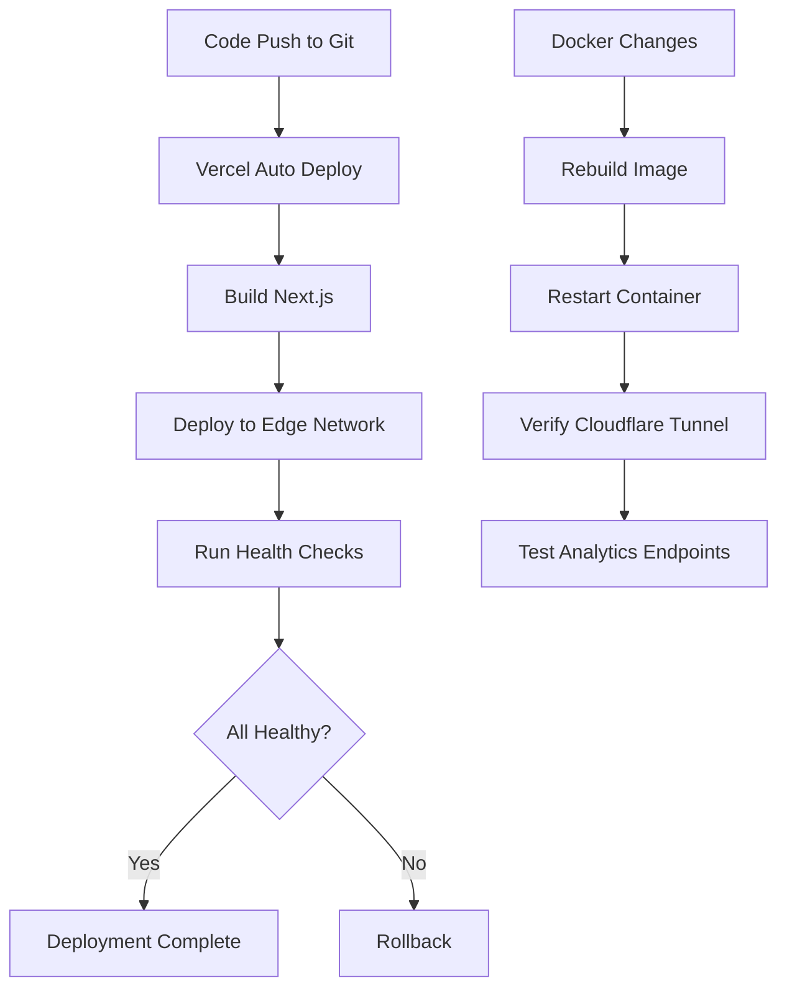

# Tài Liệu Thiết Kế - Tái Cấu Trúc Kiến Trúc Hệ Thống

## Tổng Quan

Tài liệu này mô tả thiết kế chi tiết cho việc tái cấu trúc kiến trúc NCSKIT từ monolithic local deployment sang hybrid cloud architecture với:
- **Frontend + API Gateway**: Vercel (Serverless)
- **Database + Auth + Storage**: Supabase (Managed Services)
- **R Analytics**: Docker on Local Machine + Cloudflare Tunnel

### Mục Tiêu Thiết Kế

1. **Tách biệt concerns**: Frontend, business logic, và heavy computation
2. **Tối ưu chi phí**: Sử dụng free tiers và local resources
3. **Scalability**: Frontend scale tự động trên Vercel
4. **Security**: Secure tunneling, authentication, và data encryption
5. **Performance**: CDN caching, connection pooling, và async processing

## Kiến Trúc Tổng Thể

```
┌─────────────────────────────────────────────────────────────┐
│                         INTERNET                             │
└────────────┬────────────────────────────────┬────────────────┘
             │                                │
             │                                │
    ┌────────▼────────┐              ┌───────▼────────┐
    │  Vercel CDN     │              │   Supabase     │
    │  (Global Edge)  │              │   (Cloud)      │
    └────────┬────────┘              └───────┬────────┘
             │                                │
    ┌────────▼────────────────────────────────▼────────┐
    │         Next.js Frontend (Vercel)                │
    │  ┌──────────────────────────────────────┐        │
    │  │  Pages & Components                  │        │
    │  └──────────────────────────────────────┘        │
    │  ┌──────────────────────────────────────┐        │
    │  │  API Gateway (API Routes)            │        │
    │  │  - /api/supabase/*  → Supabase       │        │
    │  │  - /api/analytics/* → Docker         │        │
    │  └──────────────────────────────────────┘        │
    └────────┬────────────────────────────────┬────────┘
             │                                │
             │                                │
    ┌────────▼────────┐              ┌────▼─────────────┐
    │  Supabase       │              │ Cloudflare Tunnel│
    │  - PostgreSQL   │              │  (Secure Proxy)  │
    │  - Auth         │              └────┬─────────────┘
    │  - Storage      │                   │
    │  - Realtime     │              ┌────▼─────────────┐
    └─────────────────┘              │ Docker Container │
                                     │  (Local Machine) │
                                     │  ┌─────────────┐ │
                                     │  │ R Analytics │ │
                                     │  │   Module    │ │
                                     │  └─────────────┘ │
                                     └──────────────────┘
```

### Luồng Dữ Liệu

**Luồng 1: User Access (Normal Features)**
```
User → Vercel CDN → Next.js Frontend → Supabase → Response
```

**Luồng 2: Analytics Request**
```
User → Vercel CDN → Next.js Frontend 
     → API Gateway → Cloudflare Tunnel 
     → Docker (R Analytics) → Response
```

**Luồng 3: Authentication**
```
User → Next.js Frontend → Supabase Auth → JWT Token → Frontend
```

## Thành Phần và Giao Diện

### 1. Frontend (Next.js on Vercel)

#### 1.1 Cấu Trúc Thư Mục

```
frontend/
├── src/
│   ├── app/
│   │   ├── (dashboard)/          # Protected dashboard routes
│   │   ├── api/
│   │   │   ├── analytics/        # Analytics API Gateway
│   │   │   │   ├── route.ts      # Main analytics endpoint
│   │   │   │   └── [action]/     # Specific analytics actions
│   │   │   ├── health/           # Health check endpoints
│   │   │   │   ├── vercel/
│   │   │   │   ├── supabase/
│   │   │   │   └── docker/
│   │   │   └── supabase/         # Supabase proxy endpoints
│   │   ├── layout.tsx
│   │   └── page.tsx
│   ├── components/
│   │   ├── analytics/            # Analytics UI components
│   │   └── ui/                   # Shared UI components
│   ├── lib/
│   │   ├── supabase/
│   │   │   ├── client.ts         # Supabase client (browser)
│   │   │   ├── server.ts         # Supabase client (server)
│   │   │   └── middleware.ts     # Auth middleware
│   │   ├── analytics/
│   │   │   ├── client.ts         # Analytics API client
│   │   │   └── types.ts          # Analytics types
│   │   └── utils/
│   ├── services/
│   │   ├── analytics.service.ts  # Analytics service layer
│   │   └── supabase.service.ts   # Supabase service layer
│   └── types/
│       ├── supabase.ts           # Supabase types
│       └── analytics.ts          # Analytics types
├── .env.local                    # Local environment
├── .env.production               # Production environment
├── next.config.ts
├── package.json
└── vercel.json                   # Vercel configuration
```

#### 1.2 API Gateway Implementation

**File: `src/app/api/analytics/route.ts`**


```typescript
// API Gateway Pattern với Circuit Breaker và Retry Logic
interface AnalyticsRequest {
  action: string;
  data: any;
  options?: {
    timeout?: number;
    cache?: boolean;
  };
}

interface AnalyticsResponse {
  success: boolean;
  data?: any;
  error?: string;
  cached?: boolean;
}

// Circuit Breaker State
let circuitState = {
  failures: 0,
  lastFailure: null,
  isOpen: false
};

export async function POST(request: Request) {
  // 1. Validate request
  const body: AnalyticsRequest = await request.json();
  
  // 2. Check circuit breaker
  if (circuitState.isOpen) {
    return Response.json({
      success: false,
      error: 'Analytics service temporarily unavailable'
    }, { status: 503 });
  }
  
  // 3. Check cache
  if (body.options?.cache) {
    const cached = await getCachedResult(body);
    if (cached) {
      return Response.json({ ...cached, cached: true });
    }
  }
  
  // 4. Forward to Docker service
  try {
    const response = await forwardToDocker(body);
    
    // Reset circuit breaker on success
    circuitState.failures = 0;
    
    // Cache result if requested
    if (body.options?.cache) {
      await cacheResult(body, response);
    }
    
    return Response.json(response);
  } catch (error) {
    // Handle circuit breaker
    circuitState.failures++;
    if (circuitState.failures >= 5) {
      circuitState.isOpen = true;
      setTimeout(() => {
        circuitState.isOpen = false;
        circuitState.failures = 0;
      }, 60000); // Reset after 1 minute
    }
    
    return Response.json({
      success: false,
      error: error.message
    }, { status: 500 });
  }
}
```

#### 1.3 Supabase Client Configuration

**File: `src/lib/supabase/client.ts`**


```typescript
import { createBrowserClient } from '@supabase/ssr'

export function createClient() {
  return createBrowserClient(
    process.env.NEXT_PUBLIC_SUPABASE_URL!,
    process.env.NEXT_PUBLIC_SUPABASE_ANON_KEY!
  )
}
```

**File: `src/lib/supabase/server.ts`**

```typescript
import { createServerClient } from '@supabase/ssr'
import { cookies } from 'next/headers'

export async function createClient() {
  const cookieStore = await cookies()

  return createServerClient(
    process.env.NEXT_PUBLIC_SUPABASE_URL!,
    process.env.NEXT_PUBLIC_SUPABASE_ANON_KEY!,
    {
      cookies: {
        get(name: string) {
          return cookieStore.get(name)?.value
        },
        set(name: string, value: string, options: any) {
          cookieStore.set({ name, value, ...options })
        },
        remove(name: string, options: any) {
          cookieStore.set({ name, value: '', ...options })
        },
      },
    }
  )
}
```

### 2. Supabase Configuration

#### 2.1 Database Schema

**Tables:**


```sql
-- Users table (managed by Supabase Auth)
-- auth.users is automatically created

-- User profiles
CREATE TABLE public.profiles (
  id UUID REFERENCES auth.users ON DELETE CASCADE PRIMARY KEY,
  email TEXT UNIQUE NOT NULL,
  full_name TEXT,
  avatar_url TEXT,
  created_at TIMESTAMP WITH TIME ZONE DEFAULT NOW(),
  updated_at TIMESTAMP WITH TIME ZONE DEFAULT NOW()
);

-- Projects
CREATE TABLE public.projects (
  id UUID DEFAULT gen_random_uuid() PRIMARY KEY,
  user_id UUID REFERENCES auth.users ON DELETE CASCADE NOT NULL,
  name TEXT NOT NULL,
  description TEXT,
  created_at TIMESTAMP WITH TIME ZONE DEFAULT NOW(),
  updated_at TIMESTAMP WITH TIME ZONE DEFAULT NOW()
);

-- Datasets
CREATE TABLE public.datasets (
  id UUID DEFAULT gen_random_uuid() PRIMARY KEY,
  project_id UUID REFERENCES public.projects ON DELETE CASCADE NOT NULL,
  name TEXT NOT NULL,
  file_url TEXT NOT NULL,
  file_size INTEGER,
  row_count INTEGER,
  column_count INTEGER,
  created_at TIMESTAMP WITH TIME ZONE DEFAULT NOW()
);

-- Analytics results cache
CREATE TABLE public.analytics_cache (
  id UUID DEFAULT gen_random_uuid() PRIMARY KEY,
  request_hash TEXT UNIQUE NOT NULL,
  action TEXT NOT NULL,
  request_data JSONB NOT NULL,
  response_data JSONB NOT NULL,
  created_at TIMESTAMP WITH TIME ZONE DEFAULT NOW(),
  expires_at TIMESTAMP WITH TIME ZONE NOT NULL
);

-- Create indexes
CREATE INDEX idx_projects_user_id ON public.projects(user_id);
CREATE INDEX idx_datasets_project_id ON public.datasets(project_id);
CREATE INDEX idx_analytics_cache_hash ON public.analytics_cache(request_hash);
CREATE INDEX idx_analytics_cache_expires ON public.analytics_cache(expires_at);
```

#### 2.2 Row Level Security (RLS) Policies


```sql
-- Enable RLS
ALTER TABLE public.profiles ENABLE ROW LEVEL SECURITY;
ALTER TABLE public.projects ENABLE ROW LEVEL SECURITY;
ALTER TABLE public.datasets ENABLE ROW LEVEL SECURITY;
ALTER TABLE public.analytics_cache ENABLE ROW LEVEL SECURITY;

-- Profiles policies
CREATE POLICY "Users can view own profile"
  ON public.profiles FOR SELECT
  USING (auth.uid() = id);

CREATE POLICY "Users can update own profile"
  ON public.profiles FOR UPDATE
  USING (auth.uid() = id);

-- Projects policies
CREATE POLICY "Users can view own projects"
  ON public.projects FOR SELECT
  USING (auth.uid() = user_id);

CREATE POLICY "Users can create own projects"
  ON public.projects FOR INSERT
  WITH CHECK (auth.uid() = user_id);

CREATE POLICY "Users can update own projects"
  ON public.projects FOR UPDATE
  USING (auth.uid() = user_id);

CREATE POLICY "Users can delete own projects"
  ON public.projects FOR DELETE
  USING (auth.uid() = user_id);

-- Datasets policies
CREATE POLICY "Users can view datasets in own projects"
  ON public.datasets FOR SELECT
  USING (
    EXISTS (
      SELECT 1 FROM public.projects
      WHERE projects.id = datasets.project_id
      AND projects.user_id = auth.uid()
    )
  );

-- Similar policies for INSERT, UPDATE, DELETE on datasets

-- Analytics cache policies (public read, system write)
CREATE POLICY "Anyone can read cache"
  ON public.analytics_cache FOR SELECT
  USING (true);
```

#### 2.3 Storage Buckets


```sql
-- Create storage buckets
INSERT INTO storage.buckets (id, name, public)
VALUES 
  ('avatars', 'avatars', true),
  ('datasets', 'datasets', false),
  ('exports', 'exports', false);

-- Storage policies for avatars
CREATE POLICY "Avatar images are publicly accessible"
  ON storage.objects FOR SELECT
  USING (bucket_id = 'avatars');

CREATE POLICY "Users can upload own avatar"
  ON storage.objects FOR INSERT
  WITH CHECK (
    bucket_id = 'avatars' 
    AND auth.uid()::text = (storage.foldername(name))[1]
  );

-- Storage policies for datasets
CREATE POLICY "Users can view own datasets"
  ON storage.objects FOR SELECT
  USING (
    bucket_id = 'datasets'
    AND auth.uid()::text = (storage.foldername(name))[1]
  );

CREATE POLICY "Users can upload own datasets"
  ON storage.objects FOR INSERT
  WITH CHECK (
    bucket_id = 'datasets'
    AND auth.uid()::text = (storage.foldername(name))[1]
  );
```

#### 2.4 Authentication Configuration

**Providers to Enable:**
- Email/Password
- Google OAuth
- LinkedIn OAuth (optional)

**Auth Settings:**
- Enable email confirmations
- Set JWT expiry: 1 hour
- Set refresh token expiry: 30 days
- Enable automatic token refresh

### 3. Docker R Analytics Module

#### 3.1 Dockerfile


```dockerfile
FROM rocker/r-ver:4.3.2

# Install system dependencies
RUN apt-get update && apt-get install -y \
    libcurl4-openssl-dev \
    libssl-dev \
    libxml2-dev \
    libpq-dev \
    && rm -rf /var/lib/apt/lists/*

# Install R packages
RUN R -e "install.packages(c( \
    'plumber', \
    'jsonlite', \
    'dplyr', \
    'tidyr', \
    'ggplot2', \
    'caret', \
    'randomForest', \
    'xgboost', \
    'text2vec', \
    'tm', \
    'wordcloud', \
    'sentimentr' \
  ), repos='https://cran.rstudio.com/')"

# Create app directory
WORKDIR /app

# Copy R scripts
COPY ./r-analytics /app

# Expose port
EXPOSE 8000

# Health check
HEALTHCHECK --interval=30s --timeout=10s --start-period=5s --retries=3 \
  CMD curl -f http://localhost:8000/health || exit 1

# Run plumber API
CMD ["R", "-e", "pr <- plumber::plumb('api.R'); pr$run(host='0.0.0.0', port=8000)"]
```

#### 3.2 R API Structure

**File: `r-analytics/api.R`**


```r
library(plumber)
library(jsonlite)

#* @apiTitle NCSKIT Analytics API
#* @apiDescription R-based analytics engine for NCSKIT

#* Health check endpoint
#* @get /health
function() {
  list(
    status = "healthy",
    timestamp = Sys.time(),
    version = "1.0.0"
  )
}

#* Sentiment analysis
#* @post /analyze/sentiment
#* @param text:character Text to analyze
function(text) {
  # Load sentiment analysis module
  source("modules/sentiment.R")
  
  result <- analyze_sentiment(text)
  
  list(
    success = TRUE,
    data = result
  )
}

#* Text clustering
#* @post /analyze/cluster
#* @param texts:[character] Array of texts
#* @param n_clusters:int Number of clusters
function(texts, n_clusters = 5) {
  source("modules/clustering.R")
  
  result <- cluster_texts(texts, n_clusters)
  
  list(
    success = TRUE,
    data = result
  )
}

#* Topic modeling
#* @post /analyze/topics
#* @param texts:[character] Array of texts
#* @param n_topics:int Number of topics
function(texts, n_topics = 5) {
  source("modules/topics.R")
  
  result <- extract_topics(texts, n_topics)
  
  list(
    success = TRUE,
    data = result
  )
}

#* Predictive modeling
#* @post /analyze/predict
#* @param data:object Training data
#* @param target:character Target variable
function(data, target) {
  source("modules/prediction.R")
  
  result <- build_model(data, target)
  
  list(
    success = TRUE,
    data = result
  )
}

#* Error handler
#* @filter error-handler
function(req, res, err) {
  res$status <- 500
  list(
    success = FALSE,
    error = as.character(err)
  )
}
```

#### 3.3 Docker Compose Configuration

**File: `docker-compose.yml`**


```yaml
version: '3.8'

services:
  r-analytics:
    build:
      context: .
      dockerfile: Dockerfile
    container_name: ncskit-r-analytics
    ports:
      - "8000:8000"
    environment:
      - R_MAX_MEMORY=4G
      - R_MAX_CORES=4
    volumes:
      - ./r-analytics:/app
      - r-packages:/usr/local/lib/R/site-library
    restart: unless-stopped
    healthcheck:
      test: ["CMD", "curl", "-f", "http://localhost:8000/health"]
      interval: 30s
      timeout: 10s
      retries: 3
      start_period: 40s
    logging:
      driver: "json-file"
      options:
        max-size: "10m"
        max-file: "3"

volumes:
  r-packages:
```

### 4. Cloudflare Tunnel Configuration

#### 4.1 Setup Steps

1. **Install cloudflared:**
```bash
# Windows
winget install --id Cloudflare.cloudflared

# macOS
brew install cloudflare/cloudflare/cloudflared

# Linux
wget https://github.com/cloudflare/cloudflared/releases/latest/download/cloudflared-linux-amd64.deb
sudo dpkg -i cloudflared-linux-amd64.deb
```

2. **Authenticate:**
```bash
cloudflared tunnel login
```

3. **Create tunnel:**
```bash
cloudflared tunnel create ncskit-analytics
```

4. **Configure tunnel:**

**File: `~/.cloudflared/config.yml`**


```yaml
tunnel: <TUNNEL_ID>
credentials-file: /path/to/.cloudflared/<TUNNEL_ID>.json

ingress:
  - hostname: analytics.ncskit.app
    service: http://localhost:8000
  - service: http_status:404
```

5. **Route DNS:**
```bash
cloudflared tunnel route dns ncskit-analytics analytics.ncskit.app
```

6. **Run tunnel:**
```bash
cloudflared tunnel run ncskit-analytics
```

#### 4.2 Systemd Service (Linux)

**File: `/etc/systemd/system/cloudflared.service`**

```ini
[Unit]
Description=Cloudflare Tunnel
After=network.target

[Service]
Type=simple
User=your-user
ExecStart=/usr/local/bin/cloudflared tunnel run ncskit-analytics
Restart=on-failure
RestartSec=5s

[Install]
WantedBy=multi-user.target
```

Enable and start:
```bash
sudo systemctl enable cloudflared
sudo systemctl start cloudflared
```

#### 4.3 Windows Service

```powershell
cloudflared service install
```

### 5. Environment Variables Configuration

#### 5.1 Development (.env.local)


```bash
# Supabase
NEXT_PUBLIC_SUPABASE_URL=https://your-project.supabase.co
NEXT_PUBLIC_SUPABASE_ANON_KEY=your-anon-key
SUPABASE_SERVICE_ROLE_KEY=your-service-role-key

# Analytics Service
NEXT_PUBLIC_ANALYTICS_URL=http://localhost:8000
ANALYTICS_API_KEY=your-local-api-key

# App Configuration
NEXT_PUBLIC_APP_URL=http://localhost:3000
NODE_ENV=development
```

#### 5.2 Production (Vercel Environment Variables)

```bash
# Supabase
NEXT_PUBLIC_SUPABASE_URL=https://your-project.supabase.co
NEXT_PUBLIC_SUPABASE_ANON_KEY=your-anon-key
SUPABASE_SERVICE_ROLE_KEY=your-service-role-key

# Analytics Service (Cloudflare Tunnel)
NEXT_PUBLIC_ANALYTICS_URL=https://analytics.ncskit.app
ANALYTICS_API_KEY=your-production-api-key

# App Configuration
NEXT_PUBLIC_APP_URL=https://ncskit.vercel.app
NODE_ENV=production

# Optional: Monitoring
SENTRY_DSN=your-sentry-dsn
VERCEL_ANALYTICS_ID=your-analytics-id
```

### 6. Migration Strategy

#### 6.1 Database Migration

**Step 1: Export from Local PostgreSQL**

```bash
# Export schema
pg_dump -h localhost -U postgres -d ncskit --schema-only > schema.sql

# Export data
pg_dump -h localhost -U postgres -d ncskit --data-only > data.sql
```

**Step 2: Transform for Supabase**

Create migration script: `migrate-to-supabase.sql`


```sql
-- 1. Create tables in public schema
-- (Copy from schema.sql, adjust as needed)

-- 2. Enable RLS
-- (Add RLS policies as defined in section 2.2)

-- 3. Create storage buckets
-- (Add storage configuration as defined in section 2.3)

-- 4. Import data
-- (Copy from data.sql, adjust user references to auth.users)
```

**Step 3: Execute Migration**

```bash
# Using Supabase CLI
supabase db push

# Or using psql
psql -h db.your-project.supabase.co -U postgres -d postgres -f migrate-to-supabase.sql
```

#### 6.2 Code Migration Checklist

- [ ] Replace `pg` imports with `@supabase/supabase-js`
- [ ] Update database queries to use Supabase client
- [ ] Replace NextAuth with Supabase Auth
- [ ] Update file upload to use Supabase Storage
- [ ] Remove unused dependencies
- [ ] Update environment variables
- [ ] Update API routes to use API Gateway pattern
- [ ] Add health check endpoints
- [ ] Update tests

### 7. Deployment Process

#### 7.1 Initial Setup

**1. Setup Supabase Project:**
```bash
# Create project at https://supabase.com
# Note down: Project URL, Anon Key, Service Role Key
```

**2. Setup Vercel Project:**
```bash
# Install Vercel CLI
npm i -g vercel

# Login
vercel login

# Link project
cd frontend
vercel link

# Add environment variables
vercel env add NEXT_PUBLIC_SUPABASE_URL
vercel env add NEXT_PUBLIC_SUPABASE_ANON_KEY
# ... add all other env vars
```

**3. Setup Docker + Cloudflare Tunnel:**
```bash
# Build Docker image
docker-compose build

# Start container
docker-compose up -d

# Setup Cloudflare Tunnel (as described in section 4.1)
cloudflared tunnel create ncskit-analytics
cloudflared tunnel route dns ncskit-analytics analytics.ncskit.app
cloudflared tunnel run ncskit-analytics
```

#### 7.2 Deployment Workflow




**Continuous Deployment:**
- Push to `main` branch → Auto deploy to production
- Push to `develop` branch → Auto deploy to preview
- Pull requests → Create preview deployments

### 8. Monitoring và Health Checks

#### 8.1 Health Check Endpoints

**Vercel Health Check:**
```typescript
// src/app/api/health/vercel/route.ts
export async function GET() {
  return Response.json({
    status: 'healthy',
    service: 'vercel',
    timestamp: new Date().toISOString(),
    region: process.env.VERCEL_REGION
  });
}
```

**Supabase Health Check:**
```typescript
// src/app/api/health/supabase/route.ts
import { createClient } from '@/lib/supabase/server';

export async function GET() {
  try {
    const supabase = await createClient();
    const { data, error } = await supabase
      .from('profiles')
      .select('count')
      .limit(1);
    
    if (error) throw error;
    
    return Response.json({
      status: 'healthy',
      service: 'supabase',
      timestamp: new Date().toISOString()
    });
  } catch (error) {
    return Response.json({
      status: 'unhealthy',
      service: 'supabase',
      error: error.message
    }, { status: 503 });
  }
}
```

**Docker Analytics Health Check:**


```typescript
// src/app/api/health/docker/route.ts
export async function GET() {
  try {
    const response = await fetch(
      `${process.env.NEXT_PUBLIC_ANALYTICS_URL}/health`,
      { 
        method: 'GET',
        signal: AbortSignal.timeout(5000) // 5s timeout
      }
    );
    
    if (!response.ok) throw new Error('Analytics service unhealthy');
    
    const data = await response.json();
    
    return Response.json({
      status: 'healthy',
      service: 'docker-analytics',
      timestamp: new Date().toISOString(),
      analytics: data
    });
  } catch (error) {
    return Response.json({
      status: 'unhealthy',
      service: 'docker-analytics',
      error: error.message
    }, { status: 503 });
  }
}
```

#### 8.2 Monitoring Dashboard

Create a simple monitoring page:

```typescript
// src/app/admin/health/page.tsx
'use client';

import { useEffect, useState } from 'react';

export default function HealthDashboard() {
  const [health, setHealth] = useState({
    vercel: null,
    supabase: null,
    docker: null
  });

  useEffect(() => {
    const checkHealth = async () => {
      const checks = await Promise.allSettled([
        fetch('/api/health/vercel').then(r => r.json()),
        fetch('/api/health/supabase').then(r => r.json()),
        fetch('/api/health/docker').then(r => r.json())
      ]);

      setHealth({
        vercel: checks[0].status === 'fulfilled' ? checks[0].value : null,
        supabase: checks[1].status === 'fulfilled' ? checks[1].value : null,
        docker: checks[2].status === 'fulfilled' ? checks[2].value : null
      });
    };

    checkHealth();
    const interval = setInterval(checkHealth, 30000); // Check every 30s

    return () => clearInterval(interval);
  }, []);

  return (
    <div className="p-8">
      <h1 className="text-2xl font-bold mb-6">System Health</h1>
      
      <div className="grid gap-4">
        <HealthCard name="Vercel" data={health.vercel} />
        <HealthCard name="Supabase" data={health.supabase} />
        <HealthCard name="Docker Analytics" data={health.docker} />
      </div>
    </div>
  );
}
```

### 9. Security Considerations

#### 9.1 API Security


**Analytics API Authentication:**

```typescript
// Middleware to verify API key
export function verifyAnalyticsApiKey(request: Request) {
  const apiKey = request.headers.get('X-API-Key');
  
  if (!apiKey || apiKey !== process.env.ANALYTICS_API_KEY) {
    throw new Error('Unauthorized');
  }
}

// Usage in API route
export async function POST(request: Request) {
  verifyAnalyticsApiKey(request);
  // ... rest of handler
}
```

**Rate Limiting:**

```typescript
import { Ratelimit } from '@upstash/ratelimit';
import { Redis } from '@upstash/redis';

const ratelimit = new Ratelimit({
  redis: Redis.fromEnv(),
  limiter: Ratelimit.slidingWindow(10, '10 s'),
});

export async function POST(request: Request) {
  const ip = request.headers.get('x-forwarded-for') ?? 'anonymous';
  const { success } = await ratelimit.limit(ip);
  
  if (!success) {
    return Response.json({ error: 'Rate limit exceeded' }, { status: 429 });
  }
  
  // ... rest of handler
}
```

#### 9.2 Data Security

- **Encryption at rest**: Supabase encrypts all data
- **Encryption in transit**: HTTPS/TLS for all connections
- **Row Level Security**: Implemented in Supabase
- **API Keys**: Stored in environment variables, never in code
- **CORS**: Configure allowed origins

```typescript
// next.config.ts
const nextConfig = {
  async headers() {
    return [
      {
        source: '/api/:path*',
        headers: [
          { key: 'Access-Control-Allow-Origin', value: 'https://ncskit.vercel.app' },
          { key: 'Access-Control-Allow-Methods', value: 'GET,POST,PUT,DELETE,OPTIONS' },
          { key: 'Access-Control-Allow-Headers', value: 'Content-Type, Authorization' },
        ],
      },
    ];
  },
};
```

### 10. Performance Optimization

#### 10.1 Caching Strategy


**Multi-layer Caching:**

```typescript
// 1. Browser cache (via headers)
export async function GET() {
  return new Response(data, {
    headers: {
      'Cache-Control': 'public, s-maxage=3600, stale-while-revalidate=86400'
    }
  });
}

// 2. Vercel Edge cache
export const revalidate = 3600; // Revalidate every hour

// 3. Database cache (analytics_cache table)
async function getCachedAnalytics(requestHash: string) {
  const { data } = await supabase
    .from('analytics_cache')
    .select('response_data')
    .eq('request_hash', requestHash)
    .gt('expires_at', new Date().toISOString())
    .single();
  
  return data?.response_data;
}

// 4. Redis cache (optional, for high-traffic)
import { Redis } from '@upstash/redis';

const redis = Redis.fromEnv();

async function getCachedResult(key: string) {
  return await redis.get(key);
}

async function setCachedResult(key: string, value: any, ttl: number) {
  await redis.set(key, value, { ex: ttl });
}
```

#### 10.2 Connection Pooling

```typescript
// Supabase automatically handles connection pooling
// For custom queries, use Supabase's built-in pooling

import { createClient } from '@supabase/supabase-js';

const supabase = createClient(
  process.env.NEXT_PUBLIC_SUPABASE_URL!,
  process.env.SUPABASE_SERVICE_ROLE_KEY!,
  {
    db: {
      schema: 'public',
    },
    auth: {
      persistSession: false,
    },
  }
);
```

#### 10.3 Async Processing

For long-running analytics:

```typescript
// Queue system using Supabase Realtime
async function queueAnalyticsJob(jobData: any) {
  const { data } = await supabase
    .from('analytics_jobs')
    .insert({
      status: 'pending',
      data: jobData,
      created_at: new Date().toISOString()
    })
    .select()
    .single();
  
  return data.id;
}

// Client subscribes to job updates
const subscription = supabase
  .channel('analytics_jobs')
  .on('postgres_changes', 
    { 
      event: 'UPDATE', 
      schema: 'public', 
      table: 'analytics_jobs',
      filter: `id=eq.${jobId}`
    }, 
    (payload) => {
      if (payload.new.status === 'completed') {
        // Handle completed job
      }
    }
  )
  .subscribe();
```

### 11. Error Handling Strategy


#### 11.1 Error Types

```typescript
export class AnalyticsError extends Error {
  constructor(
    message: string,
    public code: string,
    public statusCode: number = 500
  ) {
    super(message);
    this.name = 'AnalyticsError';
  }
}

export class ServiceUnavailableError extends AnalyticsError {
  constructor(service: string) {
    super(
      `${service} service is currently unavailable`,
      'SERVICE_UNAVAILABLE',
      503
    );
  }
}

export class ValidationError extends AnalyticsError {
  constructor(message: string) {
    super(message, 'VALIDATION_ERROR', 400);
  }
}
```

#### 11.2 Global Error Handler

```typescript
// src/app/api/error-handler.ts
export function handleApiError(error: unknown) {
  console.error('API Error:', error);
  
  if (error instanceof AnalyticsError) {
    return Response.json(
      { 
        success: false, 
        error: error.message,
        code: error.code 
      },
      { status: error.statusCode }
    );
  }
  
  // Log to monitoring service
  if (process.env.SENTRY_DSN) {
    // Sentry.captureException(error);
  }
  
  return Response.json(
    { 
      success: false, 
      error: 'Internal server error' 
    },
    { status: 500 }
  );
}
```

### 12. Testing Strategy

#### 12.1 Unit Tests

```typescript
// __tests__/lib/analytics-client.test.ts
import { describe, it, expect, vi } from 'vitest';
import { AnalyticsClient } from '@/lib/analytics/client';

describe('AnalyticsClient', () => {
  it('should call analytics API with correct parameters', async () => {
    const client = new AnalyticsClient();
    const mockFetch = vi.fn().mockResolvedValue({
      ok: true,
      json: async () => ({ success: true, data: {} })
    });
    
    global.fetch = mockFetch;
    
    await client.analyze('sentiment', { text: 'test' });
    
    expect(mockFetch).toHaveBeenCalledWith(
      expect.stringContaining('/api/analytics'),
      expect.objectContaining({
        method: 'POST',
        body: expect.any(String)
      })
    );
  });
});
```

#### 12.2 Integration Tests


```typescript
// __tests__/api/analytics.test.ts
import { describe, it, expect } from 'vitest';

describe('Analytics API', () => {
  it('should return 401 without API key', async () => {
    const response = await fetch('http://localhost:3000/api/analytics', {
      method: 'POST',
      body: JSON.stringify({ action: 'sentiment', data: {} })
    });
    
    expect(response.status).toBe(401);
  });
  
  it('should forward request to Docker service', async () => {
    const response = await fetch('http://localhost:3000/api/analytics', {
      method: 'POST',
      headers: {
        'X-API-Key': process.env.ANALYTICS_API_KEY!
      },
      body: JSON.stringify({ 
        action: 'sentiment', 
        data: { text: 'test' } 
      })
    });
    
    expect(response.ok).toBe(true);
    const data = await response.json();
    expect(data.success).toBe(true);
  });
});
```

#### 12.3 E2E Tests

```typescript
// __tests__/e2e/analytics-flow.test.ts
import { test, expect } from '@playwright/test';

test('complete analytics workflow', async ({ page }) => {
  // Login
  await page.goto('/login');
  await page.fill('[name="email"]', 'test@example.com');
  await page.fill('[name="password"]', 'password');
  await page.click('button[type="submit"]');
  
  // Navigate to analytics
  await page.goto('/dashboard/analytics');
  
  // Upload dataset
  await page.setInputFiles('[type="file"]', 'test-data.csv');
  await page.click('button:has-text("Upload")');
  
  // Run analysis
  await page.click('button:has-text("Analyze Sentiment")');
  
  // Wait for results
  await page.waitForSelector('.analytics-results', { timeout: 30000 });
  
  // Verify results displayed
  const results = await page.textContent('.analytics-results');
  expect(results).toContain('Sentiment Analysis');
});
```

## Data Models

### Supabase Types


```typescript
// src/types/supabase.ts
export interface Database {
  public: {
    Tables: {
      profiles: {
        Row: {
          id: string;
          email: string;
          full_name: string | null;
          avatar_url: string | null;
          created_at: string;
          updated_at: string;
        };
        Insert: {
          id: string;
          email: string;
          full_name?: string | null;
          avatar_url?: string | null;
          created_at?: string;
          updated_at?: string;
        };
        Update: {
          id?: string;
          email?: string;
          full_name?: string | null;
          avatar_url?: string | null;
          updated_at?: string;
        };
      };
      projects: {
        Row: {
          id: string;
          user_id: string;
          name: string;
          description: string | null;
          created_at: string;
          updated_at: string;
        };
        Insert: {
          id?: string;
          user_id: string;
          name: string;
          description?: string | null;
          created_at?: string;
          updated_at?: string;
        };
        Update: {
          id?: string;
          user_id?: string;
          name?: string;
          description?: string | null;
          updated_at?: string;
        };
      };
      datasets: {
        Row: {
          id: string;
          project_id: string;
          name: string;
          file_url: string;
          file_size: number | null;
          row_count: number | null;
          column_count: number | null;
          created_at: string;
        };
        Insert: {
          id?: string;
          project_id: string;
          name: string;
          file_url: string;
          file_size?: number | null;
          row_count?: number | null;
          column_count?: number | null;
          created_at?: string;
        };
        Update: {
          id?: string;
          project_id?: string;
          name?: string;
          file_url?: string;
          file_size?: number | null;
          row_count?: number | null;
          column_count?: number | null;
        };
      };
      analytics_cache: {
        Row: {
          id: string;
          request_hash: string;
          action: string;
          request_data: any;
          response_data: any;
          created_at: string;
          expires_at: string;
        };
        Insert: {
          id?: string;
          request_hash: string;
          action: string;
          request_data: any;
          response_data: any;
          created_at?: string;
          expires_at: string;
        };
        Update: {
          id?: string;
          request_hash?: string;
          action?: string;
          request_data?: any;
          response_data?: any;
          expires_at?: string;
        };
      };
    };
  };
}
```

### Analytics Types

```typescript
// src/types/analytics.ts
export interface AnalyticsRequest {
  action: 'sentiment' | 'cluster' | 'topics' | 'predict';
  data: any;
  options?: {
    timeout?: number;
    cache?: boolean;
    cacheTTL?: number;
  };
}

export interface AnalyticsResponse<T = any> {
  success: boolean;
  data?: T;
  error?: string;
  cached?: boolean;
  processingTime?: number;
}

export interface SentimentResult {
  score: number;
  label: 'positive' | 'negative' | 'neutral';
  confidence: number;
}

export interface ClusterResult {
  clusters: Array<{
    id: number;
    texts: string[];
    centroid: number[];
    size: number;
  }>;
  silhouetteScore: number;
}

export interface TopicResult {
  topics: Array<{
    id: number;
    words: Array<{ word: string; weight: number }>;
    documents: number[];
  }>;
}
```

## Tổng Kết Thiết Kế

### Ưu Điểm Kiến Trúc Mới

1. **Chi phí thấp**: 
   - Vercel free tier: 100GB bandwidth/month
   - Supabase free tier: 500MB database, 1GB storage
   - Docker chạy local: Không tốn phí hosting

2. **Performance cao**:
   - CDN global từ Vercel
   - Connection pooling từ Supabase
   - Caching đa tầng

3. **Scalability**:
   - Frontend auto-scale trên Vercel
   - Database scale theo nhu cầu trên Supabase
   - Analytics có thể scale bằng cách thêm containers

4. **Security**:
   - HTTPS everywhere
   - Row Level Security
   - Secure tunneling
   - API authentication

5. **Developer Experience**:
   - Auto deployments
   - Preview deployments
   - Easy rollbacks
   - Comprehensive monitoring

### Nhược Điểm và Giải Pháp

1. **Docker phải chạy 24/7**:
   - Giải pháp: Sử dụng systemd/Windows Service để auto-restart
   - Fallback: Hiển thị thông báo khi service down

2. **Cloudflare Tunnel có thể disconnect**:
   - Giải pháp: Auto-reconnect trong config
   - Monitoring: Health checks mỗi 30s

3. **Cold start trên Vercel**:
   - Giải pháp: Keep-alive requests
   - Sử dụng Vercel Pro nếu cần (zero cold start)

4. **R analytics chậm**:
   - Giải pháp: Async processing với job queue
   - Caching aggressive cho repeated queries
