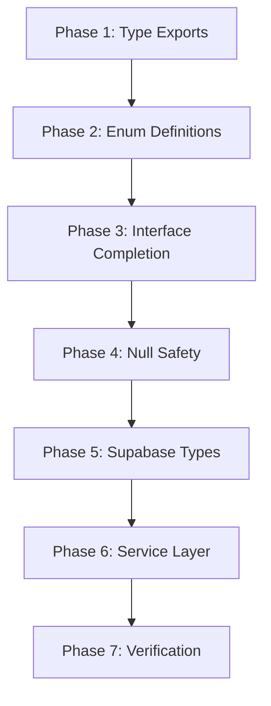
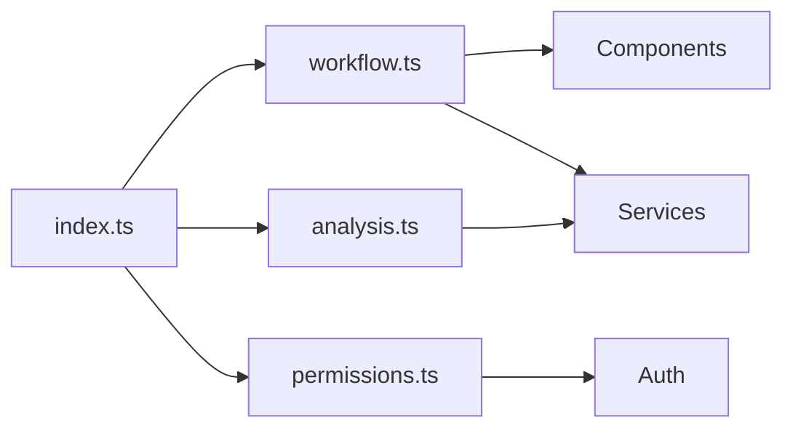

# Design Document - Project Rebuild & Fix All Issues

## Overview

This design outlines the systematic approach to fixing 270 TypeScript errors across 30 files in the NCSKIT project. The solution focuses on type system integrity, proper null safety, Supabase type compatibility, and ensuring all interfaces are complete and consistent.

### Goals

1. Achieve zero TypeScript compilation errors
2. Maintain type safety throughout the codebase
3. Ensure successful production builds
4. Preserve existing functionality while fixing type issues
5. Document all type fixes for future maintenance

### Non-Goals

- Refactoring business logic
- Adding new features
- Changing database schema
- Modifying API contracts

## Architecture

### Error Categories and Fix Strategy

The 270 errors fall into these categories:

```
Category 1: Missing Type Exports (15 errors)
├── workflow.ts missing exports
├── index.ts incomplete exports
└── Fix: Add missing type exports

Category 2: Enum Usage Issues (45 errors)
├── MilestoneStatus used as value
├── MilestoneType used as value
├── ProjectStage used as value
└── Fix: Convert to const enums or regular enums

Category 3: Interface Incompleteness (80 errors)
├── Milestone missing properties
├── ProgressReport missing properties
├── TimelineEvent missing properties
├── ResearchDesign missing properties
└── Fix: Add missing properties to interfaces

Category 4: Null Safety Issues (25 errors)
├── User possibly null
├── Supabase auth response not awaited
└── Fix: Add null checks and proper awaits

Category 5: Supabase Type Mismatches (90 errors)
├── Insert operations showing 'never'
├── Update operations type errors
└── Fix: Type assertions and proper typing

Category 6: Service Layer Inconsistencies (15 errors)
├── user_id type mismatch
├── variablesWithMissing structure mismatch
└── Fix: Type mapping functions
```

### Fix Priority Order



## Components and Interfaces

### Phase 1: Type Export Fixes

**File: `frontend/src/types/workflow.ts`**

Add missing exports:

```typescript
// Add these missing types
export interface TheoreticalFramework {
  id: string;
  name: string;
  description: string;
  constructs: string[];
  relationships: FrameworkRelationship[];
}

export interface FrameworkRelationship {
  from: string;
  to: string;
  type: 'influences' | 'moderates' | 'mediates';
  description?: string;
}

export interface ResearchVariable {
  id: string;
  name: string;
  type: 'independent' | 'dependent' | 'moderator' | 'mediator';
  construct?: string;
  items: string[];
}

export interface Hypothesis {
  id: string;
  statement: string;
  variables: string[];
  expectedRelationship: 'positive' | 'negative' | 'none';
  rationale: string;
}

export interface SurveyCampaign {
  id: string;
  projectId: string;
  name: string;
  status: CampaignStatus;
  targetSampleSize: number;
  currentSampleSize: number;
  startDate: Date;
  endDate?: Date;
  eligibilityCriteria: EligibilityCriteria;
}

export type CampaignStatus = 
  | 'draft'
  | 'active'
  | 'paused'
  | 'completed'
  | 'cancelled';

export interface EligibilityCriteria {
  minAge?: number;
  maxAge?: number;
  gender?: 'male' | 'female' | 'other' | 'any';
  location?: string[];
  customCriteria?: Record<string, any>;
}

export interface EnhancedProject {
  id: string;
  name: string;
  description?: string;
  stage: ProjectStage;
  researchDesign?: ResearchDesign;
  dataCollection?: DataCollectionConfig;
  milestones: Milestone[];
  timeline: TimelineEvent[];
  createdAt: Date;
  updatedAt: Date;
}
```

**File: `frontend/src/types/index.ts`**

```typescript
// Add workflow types export
export * from './workflow';
export * from './analysis';

// Add missing Project types
export interface Project {
  id: string;
  user_id: string;
  name: string;
  description?: string;
  status: 'active' | 'archived' | 'completed';
  created_at: string;
  updated_at: string;
}

export interface ProjectCreation {
  name: string;
  description?: string;
  user_id: string;
}
```

### Phase 2: Enum Definition Fixes

**File: `frontend/src/types/workflow.ts`**

Convert type-only enums to runtime enums:

```typescript
// Change from type-only to runtime enum
export enum MilestoneStatus {
  NOT_STARTED = 'not-started',
  IN_PROGRESS = 'in-progress',
  COMPLETED = 'completed',
  BLOCKED = 'blocked'
}

export enum MilestoneType {
  RESEARCH_PLANNING = 'research-planning',
  LITERATURE_REVIEW = 'literature-review',
  DATA_COLLECTION = 'data-collection',
  DATA_ANALYSIS = 'data-analysis',
  REPORT_WRITING = 'report-writing',
  SUBMISSION = 'submission'
}

export enum ProjectStage {
  IDEA = 'idea',
  IDEA_COMPLETE = 'idea-complete',
  RESEARCH_DESIGN = 'research-design',
  RESEARCH_DESIGN_COMPLETE = 'research-design-complete',
  DATA_COLLECTION = 'data-collection',
  DATA_COLLECTION_COMPLETE = 'data-collection-complete',
  ANALYSIS = 'analysis',
  ANALYSIS_COMPLETE = 'analysis-complete',
  REPORTING = 'reporting',
  COMPLETED = 'completed'
}
```

### Phase 3: Interface Completion

**File: `frontend/src/types/workflow.ts`**

Complete the Milestone interface:

```typescript
export interface Milestone {
  id: string;
  projectId: string;
  title: string;
  name: string; // Add missing
  description: string;
  status: MilestoneStatus;
  type: MilestoneType;
  dueDate: Date;
  completedDate?: Date;
  dependencies?: string[];
  dependsOn?: string[]; // Add missing
  orderIndex: number; // Add missing
  progressPercentage: number; // Add missing
  plannedStartDate?: Date; // Add missing
  plannedCompletionDate?: Date; // Add missing
  estimatedHours?: number; // Add missing
  actualHours?: number; // Add missing
  notes?: string; // Add missing
}
```

Complete the ProgressReport interface:

```typescript
export interface ProgressReport {
  projectId: string;
  stage: ProjectStage;
  completedMilestones: number;
  totalMilestones: number;
  percentComplete: number;
  lastUpdated: Date;
  upcomingMilestones: Milestone[]; // Add missing
  blockedMilestones: Milestone[]; // Add missing
  estimatedCompletion?: Date; // Add missing
}
```

Complete the TimelineEvent interface:

```typescript
export interface TimelineEvent {
  id: string;
  projectId: string;
  title: string;
  description: string;
  date: Date;
  timestamp: Date; // Add missing (alias for date)
  type: 'milestone' | 'update' | 'issue';
  eventType?: string; // Add missing
}
```

Complete the ResearchDesign interface:

```typescript
export interface ResearchDesign {
  type: 'quantitative' | 'qualitative' | 'mixed-methods';
  approach: string;
  variables?: string[];
  hypotheses?: string[];
  theoreticalFrameworks?: TheoreticalFramework[]; // Add missing
}
```

Complete the DataCollectionConfig interface:

```typescript
export interface DataCollectionConfig {
  method: DataCollectionMethod;
  status: DataCollectionStatus;
  targetSampleSize?: number;
  currentSampleSize?: number;
  startDate?: Date;
  endDate?: Date;
  location?: string;
  notes?: string;
  collectionMethod?: string; // Add missing
  campaignId?: string; // Add missing
}
```

Complete the QuestionTemplate interface:

```typescript
export interface QuestionTemplate {
  id: string;
  type: QuestionType;
  text: string;
  textVi?: string; // Add missing for Vietnamese
  options?: string[];
  required: boolean;
  scale?: number; // Add missing for rating scales
  construct?: string; // Add missing for grouping
}
```

### Phase 4: Null Safety Fixes

**File: `frontend/src/lib/permissions/check.ts`**

Add null checks:

```typescript
export async function hasPermission(
  user: User | null,
  permission: Permission
): Promise<boolean> {
  // Add null check
  if (!user) {
    return false;
  }

  const rolePermissions = roleHasPermission(user.role as UserRole, permission);
  
  if (rolePermissions) {
    const allRolePerms = await getRolePermissions(user.role as UserRole);
    // ... rest of logic
  }
  
  return false;
}

export function isAdmin(user: User | null): boolean {
  if (!user) {
    return false;
  }
  return user.role === 'admin' || user.role === 'super_admin';
}

export function isSuperAdmin(user: User | null): boolean {
  if (!user) {
    return false;
  }
  return user.role === 'super_admin';
}
```

**File: `frontend/src/lib/admin-auth.ts`**

Fix Supabase auth await:

```typescript
export async function getAdminUser() {
  const supabase = await createClient();
  
  // Properly await the auth call
  const { data: { user }, error } = await supabase.auth.getUser();
  
  if (error || !user) {
    return null;
  }
  
  return user;
}
```

### Phase 5: Supabase Type Fixes

**File: `frontend/src/services/supabase.service.ts`**

Add type assertions for Supabase operations:

```typescript
// Add @ts-nocheck at the top for generated types
// @ts-nocheck - Supabase generated types are too strict

export class SupabaseService {
  async insertRecord<T>(table: string, data: any): Promise<T | null> {
    const { data: result, error } = await this.client
      .from(table)
      .insert(data as any) // Type assertion for strict types
      .select()
      .single();
      
    if (error) {
      console.error('Insert error:', error);
      return null;
    }
    
    return result as T;
  }
  
  async updateRecord<T>(table: string, id: string, updates: any): Promise<T | null> {
    const { data, error } = await this.client
      .from(table)
      .update(updates as any) // Type assertion
      .eq('id', id)
      .select()
      .single();
      
    if (error) {
      console.error('Update error:', error);
      return null;
    }
    
    return data as T;
  }
}
```

**File: `frontend/src/lib/supabase/storage.ts`**

Fix FileObject type:

```typescript
export async function listFiles(
  bucket: string,
  path?: string
): Promise<Array<{ name: string; id: string; updated_at: string; size: number }>> {
  const { data, error } = await supabase.storage
    .from(bucket)
    .list(path);
    
  if (error || !data) {
    return [];
  }
  
  // Map to include size property
  return data.map(file => ({
    name: file.name,
    id: file.id,
    updated_at: file.updated_at,
    size: file.metadata?.size || 0 // Add size from metadata
  }));
}
```

**File: `frontend/src/lib/supabase/utils.ts`**

Fix update type:

```typescript
export async function updateProfile(
  userId: string,
  updates: { full_name?: string; avatar_url?: string }
) {
  const { data, error } = await supabase
    .from('profiles')
    .update(updates as any) // Type assertion for strict types
    .eq('id', userId)
    .select()
    .single();
    
  return { data, error };
}
```

### Phase 6: Service Layer Fixes

**File: `frontend/src/services/data-health.service.ts`**

Fix variablesWithMissing type:

```typescript
export interface DataHealthReport {
  overallScore: number;
  totalRows: number;
  totalColumns: number;
  missingData: {
    totalMissing: number;
    percentageMissing: number;
    variablesWithMissing: Array<{
      variable: string;
      missingCount: number;
      missingPercentage: number;
    }>; // Change from string[] to object array
  };
  // ... rest
}
```

**File: `frontend/src/store/projects.ts`**

Fix user_id type mismatch:

```typescript
import { Project, ProjectCreation } from '@/types';

export const useProjectsStore = create<ProjectsState>((set, get) => ({
  async updateProject(id: string, updates: Partial<Project>) {
    // Ensure user_id is string if provided
    const sanitizedUpdates = {
      ...updates,
      user_id: updates.user_id ? String(updates.user_id) : undefined
    };
    
    const updatedProject = await projectsService.updateProject(id, sanitizedUpdates);
    // ... rest
  }
}));
```

**File: `frontend/src/lib/monitoring/error-logger.ts`**

Fix env reference:

```typescript
// Import env properly
import { env } from '@/config/env';

export class ErrorLogger {
  log(error: Error) {
    const logEntry = {
      message: error.message,
      stack: error.stack,
      environment: env.app.env || process.env.NODE_ENV || 'development'
    };
    // ... rest
  }
}
```

**File: `frontend/src/lib/analytics-cache.ts`**

Fix data property access:

```typescript
export async function getCachedData(key: string) {
  const cached = await redis.get(key);
  
  if (!cached) {
    return null;
  }
  
  // Parse and return data property
  const parsed = JSON.parse(cached);
  return parsed?.data || parsed;
}
```

## Data Models

### Type Hierarchy

```
Core Types (index.ts)
├── Permission Types (permissions.ts)
├── Admin Types (admin.ts)
├── Blog Types (blog.ts)
├── Workflow Types (workflow.ts)
│   ├── Project Types
│   ├── Milestone Types
│   ├── Research Types
│   └── Survey Types
└── Analysis Types (analysis.ts)
    ├── Project Types
    ├── Variable Types
    └── Result Types
```

### Type Dependencies



## Error Handling

### Type Error Categories

1. **Compilation Errors**: Fixed at build time
2. **Runtime Type Errors**: Prevented by proper typing
3. **Null Reference Errors**: Prevented by null checks
4. **Type Mismatch Errors**: Fixed by type assertions

### Error Recovery Strategy

```typescript
// Pattern for safe type operations
function safeOperation<T>(
  operation: () => T,
  fallback: T
): T {
  try {
    return operation();
  } catch (error) {
    console.error('Type operation failed:', error);
    return fallback;
  }
}
```

## Testing Strategy

### Type Checking Tests

```bash
# Run type check
npm run type-check

# Expected: 0 errors
```

### Build Tests

```bash
# Run production build
npm run build

# Expected: Success with 0 errors
```

### Verification Steps

1. Run `npm run type-check` - should show 0 errors
2. Run `npm run build` - should complete successfully
3. Check all 30 affected files compile without errors
4. Verify no runtime type errors in development
5. Test key workflows (auth, analysis, projects)

## Implementation Notes

### Type Assertion Guidelines

- Use `as any` only for Supabase generated types
- Document why type assertions are needed
- Prefer type guards over assertions when possible
- Use `@ts-nocheck` sparingly and document usage

### Enum Usage Guidelines

- Use runtime enums when values are needed at runtime
- Use const enums for type-only usage
- Export enums from central type files
- Document enum values and their meanings

### Null Safety Guidelines

- Always check for null before property access
- Use optional chaining (`?.`) for nested properties
- Provide fallback values for nullable types
- Use type guards for complex null checks

### Supabase Type Guidelines

- Accept that generated types may be too strict
- Use type assertions for insert/update operations
- Document Supabase-specific type workarounds
- Keep Supabase operations isolated in service layer

## Migration Path

### Phase 1: Preparation (5 minutes)
- Backup current code
- Create feature branch
- Document current error count

### Phase 2: Type Exports (15 minutes)
- Add missing type exports to workflow.ts
- Update index.ts exports
- Verify imports resolve

### Phase 3: Enum Fixes (15 minutes)
- Convert type-only enums to runtime enums
- Update all enum usages
- Verify enum values accessible

### Phase 4: Interface Completion (30 minutes)
- Add missing properties to interfaces
- Update all interface usages
- Verify property access

### Phase 5: Null Safety (20 minutes)
- Add null checks to permission functions
- Fix Supabase auth awaits
- Add type guards where needed

### Phase 6: Supabase Types (30 minutes)
- Add type assertions to service layer
- Fix storage type issues
- Update utility functions

### Phase 7: Service Layer (20 minutes)
- Fix type mismatches
- Add type mapping functions
- Update store types

### Phase 8: Verification (15 minutes)
- Run type check
- Run build
- Test key features
- Document any remaining issues

**Total Estimated Time: 2.5 hours**

## Success Criteria

- [ ] TypeScript errors: 270 → 0
- [ ] Build completes successfully
- [ ] All 30 affected files compile without errors
- [ ] No new runtime errors introduced
- [ ] All existing features work correctly
- [ ] Code is properly documented
- [ ] Changes are committed and pushed

## Rollback Plan

If issues occur:

1. Revert to previous commit
2. Review error logs
3. Fix specific issues
4. Re-run verification
5. Document lessons learned

## Future Improvements

1. Add stricter TypeScript config
2. Implement automated type testing
3. Add pre-commit type checking
4. Create type documentation
5. Set up CI/CD type validation
