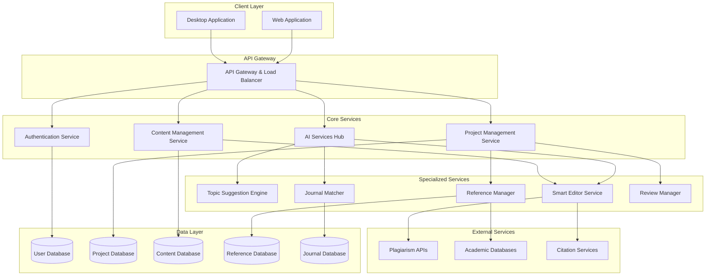

# ResearchOS Design Document

## Overview

ResearchOS is a comprehensive research management platform that provides end-to-end support for the academic publication workflow. The system is designed as a modular, scalable platform that can be deployed as both a web application and desktop application, with seamless data synchronization between platforms.

The architecture follows a microservices approach with clear separation of concerns, enabling independent development and scaling of different research workflow components. The platform integrates AI-powered tools throughout the research lifecycle while maintaining data security and academic integrity.

## Architecture

### High-Level Architecture



### Technology Stack

**Frontend:**
- Web App: Next.js with TypeScript for responsive, modern UI with SSR capabilities
- State Management: Zustand or Redux Toolkit for complex state management
- UI Framework: Tailwind CSS with Headless UI for consistent design system
- Real-time Features: WebSocket connections for collaborative editing

**Backend:**
- API Gateway: Python with FastAPI for high-performance API routing
- Core Services: Django for robust web framework with ORM
- Data Analysis Services: R as dedicated microservice for statistical analysis
- AI Services: Python with scikit-learn, TensorFlow for ML/AI components
- Authentication: JWT with refresh tokens, Django authentication system
- Task Queue: Celery with Redis for background processing

**Desktop App:**
- Framework: Tauri with Rust for lightweight, secure native experience
- Frontend: Same Next.js/TypeScript codebase embedded in Tauri
- Native Integration: Rust for file system operations and OS integration

**Database:**
- Primary Database: PostgreSQL for all structured data (users, projects, references, metadata)
- Search Engine: PostgreSQL full-text search with pg_trgm extension
- Cache Layer: Redis for session management and performance optimization
- File Storage: Local file system with PostgreSQL metadata tracking

**Infrastructure:**
- Containerization: Docker for service deployment
- Orchestration: Kubernetes for production scaling
- File Storage: AWS S3 or similar for document and media storage
- CDN: CloudFront for global content delivery

## Components and Interfaces

### 1. Authentication & User Management

**Responsibilities:**
- User registration, login, and profile management
- Role-based access control (individual researchers, institutions)
- Session management and security

**Key Interfaces:**
```typescript
interface UserService {
  authenticate(credentials: LoginCredentials): Promise<AuthResult>
  createUser(userData: UserRegistration): Promise<User>
  updateProfile(userId: string, updates: ProfileUpdates): Promise<User>
  manageSubscription(userId: string, plan: SubscriptionPlan): Promise<Subscription>
}
```

### 2. Project Management Service

**Responsibilities:**
- Research project lifecycle management
- Timeline and milestone tracking
- Collaboration and team management

**Key Interfaces:**
```typescript
interface ProjectService {
  createProject(projectData: ProjectCreation): Promise<Project>
  updateProgress(projectId: string, progress: ProgressUpdate): Promise<Project>
  inviteCollaborators(projectId: string, invitations: Invitation[]): Promise<void>
  getProjectDashboard(userId: string): Promise<DashboardData>
}
```

### 3. Topic Suggestion Engine

**Responsibilities:**
- AI-powered research topic recommendations
- Trend analysis and gap identification
- Personalized suggestions based on user history

**Key Interfaces:**
```typescript
interface TopicSuggestionService {
  generateTopics(domain: ResearchDomain, preferences: UserPreferences): Promise<TopicSuggestion[]>
  analyzeTrends(field: string): Promise<TrendAnalysis>
  validateTopicNovelty(topic: string): Promise<NoveltyScore>
}
```

### 4. Reference Manager

**Responsibilities:**
- Document import and metadata extraction
- Advanced search and categorization
- Bibliography generation

**Key Interfaces:**
```typescript
interface ReferenceService {
  importDocument(file: File, metadata?: DocumentMetadata): Promise<Reference>
  searchReferences(query: SearchQuery): Promise<SearchResults>
  organizeReferences(projectId: string, organization: ReferenceOrganization): Promise<void>
  generateBibliography(references: Reference[], style: CitationStyle): Promise<string>
}
```

### 5. Smart Editor Service

**Responsibilities:**
- AI-powered writing assistance
- Real-time grammar and style checking
- Academic formatting and structure guidance

**Key Interfaces:**
```typescript
interface SmartEditorService {
  provideWritingSuggestions(content: string, context: WritingContext): Promise<Suggestion[]>
  checkGrammarAndStyle(text: string): Promise<GrammarCheck>
  formatAcademicContent(content: string, style: AcademicStyle): Promise<string>
  trackChanges(documentId: string, changes: DocumentChange[]): Promise<void>
}
```

### 6. Journal Matcher

**Responsibilities:**
- Content analysis for journal recommendations
- Journal database maintenance
- Submission tracking

**Key Interfaces:**
```typescript
interface JournalService {
  matchJournals(paperContent: PaperContent): Promise<JournalMatch[]>
  getJournalDetails(journalId: string): Promise<JournalDetails>
  trackSubmission(submissionData: SubmissionTracking): Promise<Submission>
  updateJournalDatabase(): Promise<void>
}
```

### 7. Review Manager

**Responsibilities:**
- Peer review feedback organization
- Response drafting assistance
- Review timeline management

**Key Interfaces:**
```typescript
interface ReviewService {
  organizeReviewFeedback(feedback: ReviewFeedback[]): Promise<OrganizedReview>
  generateResponseDraft(review: Review, authorNotes: string): Promise<ResponseDraft>
  trackReviewProcess(submissionId: string): Promise<ReviewStatus>
}
```

## Data Models

### Core Entities

```typescript
// User and Authentication
interface User {
  id: string
  email: string
  profile: UserProfile
  subscription: SubscriptionPlan
  preferences: UserPreferences
  createdAt: Date
  updatedAt: Date
}

// Project Management
interface Project {
  id: string
  title: string
  description: string
  phase: ResearchPhase
  status: ProjectStatus
  timeline: ProjectTimeline
  collaborators: Collaborator[]
  documents: Document[]
  references: Reference[]
  createdAt: Date
  updatedAt: Date
}

// Content Management
interface Document {
  id: string
  projectId: string
  title: string
  content: string
  version: number
  type: DocumentType
  metadata: DocumentMetadata
  collaborativeEdits: Edit[]
  createdAt: Date
  updatedAt: Date
}

// Reference Management
interface Reference {
  id: string
  title: string
  authors: Author[]
  publication: Publication
  metadata: ReferenceMetadata
  tags: string[]
  notes: string
  attachments: Attachment[]
  createdAt: Date
}

// Journal and Submission
interface Journal {
  id: string
  name: string
  publisher: string
  impactFactor: number
  acceptanceRate: number
  submissionGuidelines: SubmissionGuidelines
  categories: ResearchCategory[]
  ranking: JournalRanking
}
```

## Error Handling

### Error Categories

1. **Authentication Errors**: Invalid credentials, expired tokens, unauthorized access
2. **Validation Errors**: Invalid input data, missing required fields, format violations
3. **Business Logic Errors**: Workflow violations, permission conflicts, resource constraints
4. **External Service Errors**: AI service failures, database connectivity, third-party API issues
5. **System Errors**: Server errors, network issues, resource exhaustion

### Error Response Strategy

```typescript
interface ErrorResponse {
  error: {
    code: string
    message: string
    details?: any
    timestamp: Date
    requestId: string
  }
}

// Error handling middleware
class ErrorHandler {
  static handleAPIError(error: Error, context: RequestContext): ErrorResponse
  static logError(error: Error, context: RequestContext): void
  static notifyAdmins(criticalError: Error): void
}
```

### Resilience Patterns

- **Circuit Breaker**: Prevent cascading failures from external services
- **Retry Logic**: Automatic retry with exponential backoff for transient failures
- **Graceful Degradation**: Fallback functionality when AI services are unavailable
- **Data Backup**: Regular automated backups with point-in-time recovery

## Testing Strategy

### Testing Pyramid

**Unit Tests (70%)**
- Individual service methods and business logic
- Data model validation and transformations
- Utility functions and helpers
- AI model integration points

**Integration Tests (20%)**
- Service-to-service communication
- Database operations and queries
- External API integrations
- Authentication and authorization flows

**End-to-End Tests (10%)**
- Complete user workflows across the platform
- Cross-platform synchronization (web ↔ desktop)
- Performance and load testing
- Security and penetration testing

### Testing Tools and Frameworks

- **Unit Testing**: Jest for TypeScript/Next.js, pytest for Python/Django, testthat for R
- **Integration Testing**: Django Test Framework for API testing, Testcontainers for database testing
- **E2E Testing**: Playwright for web application testing, Tauri's testing framework for desktop app
- **Performance Testing**: Artillery for load testing, Lighthouse for web performance
- **Security Testing**: OWASP ZAP for security scanning, Snyk for dependency vulnerabilities

### Continuous Testing

- Automated test execution on every commit
- Parallel test execution for faster feedback
- Test coverage reporting and enforcement (minimum 80% coverage)
- Automated security and dependency scanning
- Performance regression detection

### AI/ML Model Testing

- Model accuracy and performance benchmarks
- A/B testing for AI feature improvements
- Bias detection and fairness testing
- Model versioning and rollback capabilities