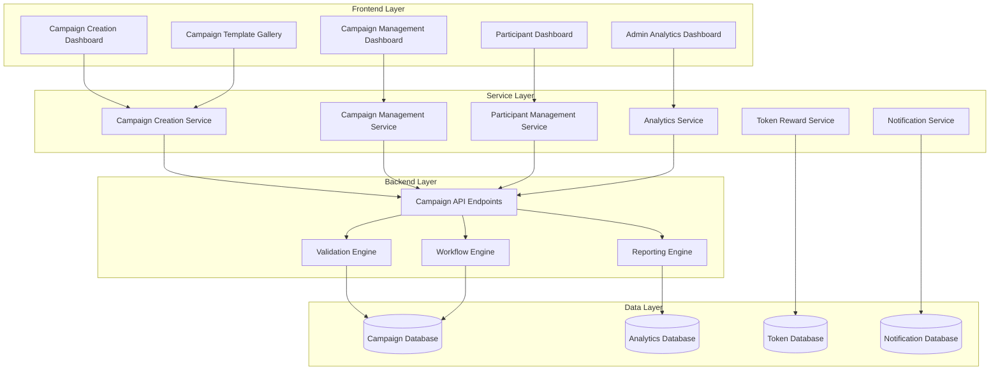
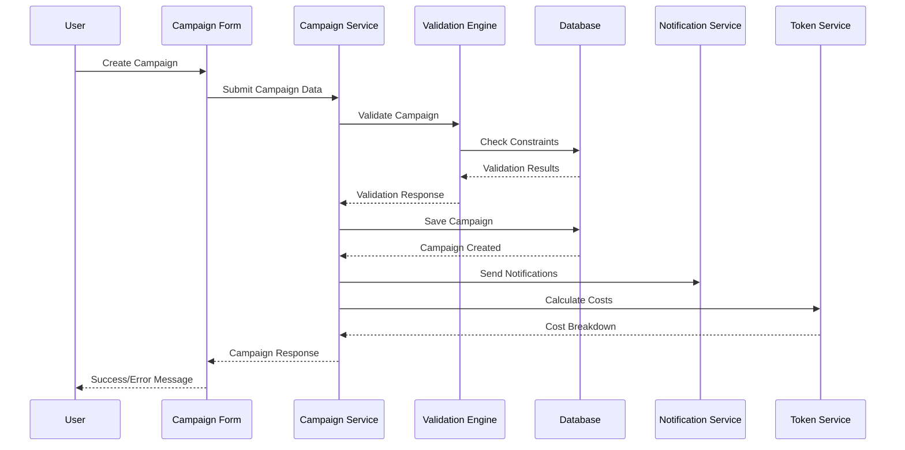

# Survey Campaign Enhancement Design

## Overview

This design document outlines the comprehensive enhancement of the survey campaign system in NCSKIT. The system will provide an intuitive, scalable platform for researchers to create, manage, and analyze survey campaigns while ensuring seamless participant experience and robust admin oversight.

## Architecture

### System Components



### Data Flow Architecture



## Components and Interfaces

### 1. Campaign Creation System

#### Campaign Creation Wizard
```typescript
interface CampaignCreationWizard {
  steps: CampaignStep[]
  currentStep: number
  formData: CampaignFormData
  validation: ValidationState
  
  // Methods
  nextStep(): void
  previousStep(): void
  validateStep(stepIndex: number): ValidationResult
  submitCampaign(): Promise<Campaign>
  saveDraft(): Promise<void>
}

interface CampaignStep {
  id: string
  title: string
  description: string
  component: React.ComponentType
  validation: ValidationRules
  isOptional: boolean
}

interface CampaignFormData {
  basicInfo: {
    title: string
    description: string
    category: CampaignCategory
    tags: string[]
  }
  targeting: {
    targetParticipants: number
    eligibilityCriteria: EligibilityCriteria
    demographicFilters: DemographicFilters
  }
  rewards: {
    tokenRewardPerParticipant: number
    totalBudget: number
    adminFeePercentage: number
    estimatedCost: number
  }
  scheduling: {
    startDate?: Date
    endDate?: Date
    duration: number
    autoLaunch: boolean
  }
  survey: {
    surveyId?: string
    surveyConfig: SurveyConfiguration
    estimatedCompletionTime: number
  }
  settings: {
    allowMultipleResponses: boolean
    requireApproval: boolean
    autoApproveParticipants: boolean
    maxResponsesPerUser: number
  }
}
```

#### Template System
```typescript
interface CampaignTemplate {
  id: string
  name: string
  description: string
  category: TemplateCategory
  previewImage?: string
  
  // Template configuration
  defaultSettings: Partial<CampaignFormData>
  customizableFields: string[]
  requiredFields: string[]
  
  // Metadata
  usageCount: number
  rating: number
  isPublic: boolean
  isFeatured: boolean
  createdBy: string
  tags: string[]
}

interface TemplateGallery {
  templates: CampaignTemplate[]
  categories: TemplateCategory[]
  
  // Methods
  searchTemplates(query: string): CampaignTemplate[]
  filterByCategory(category: TemplateCategory): CampaignTemplate[]
  getPopularTemplates(): CampaignTemplate[]
  getFeaturedTemplates(): CampaignTemplate[]
  createFromTemplate(templateId: string, customData: Partial<CampaignFormData>): Promise<Campaign>
}
```

### 2. Campaign Management System

#### Campaign Dashboard
```typescript
interface CampaignDashboard {
  campaigns: Campaign[]
  filters: CampaignFilters
  sorting: SortingOptions
  pagination: PaginationState
  
  // Methods
  loadCampaigns(filters?: CampaignFilters): Promise<Campaign[]>
  searchCampaigns(query: string): Promise<Campaign[]>
  updateCampaignStatus(campaignId: string, status: CampaignStatus): Promise<Campaign>
  duplicateCampaign(campaignId: string): Promise<Campaign>
  deleteCampaign(campaignId: string): Promise<void>
}

interface CampaignFilters {
  status?: CampaignStatus[]
  category?: CampaignCategory[]
  dateRange?: DateRange
  createdBy?: string
  participantRange?: NumberRange
  budgetRange?: NumberRange
}

interface CampaignActions {
  launch(campaignId: string): Promise<Campaign>
  pause(campaignId: string): Promise<Campaign>
  resume(campaignId: string): Promise<Campaign>
  complete(campaignId: string): Promise<Campaign>
  cancel(campaignId: string): Promise<Campaign>
  
  // Bulk actions
  bulkStatusUpdate(campaignIds: string[], status: CampaignStatus): Promise<Campaign[]>
  bulkDelete(campaignIds: string[]): Promise<void>
}
```

#### Real-time Updates
```typescript
interface CampaignRealTimeService {
  subscribeToUpdates(campaignId: string, callback: (update: CampaignUpdate) => void): void
  unsubscribeFromUpdates(campaignId: string): void
  
  // WebSocket connection management
  connect(): Promise<void>
  disconnect(): void
  isConnected(): boolean
}

interface CampaignUpdate {
  campaignId: string
  updateType: 'status' | 'participation' | 'completion' | 'error'
  data: any
  timestamp: Date
}
```

### 3. Participant Experience System

#### Participant Dashboard
```typescript
interface ParticipantDashboard {
  availableCampaigns: Campaign[]
  participatedCampaigns: ParticipationRecord[]
  eligibleCampaigns: Campaign[]
  rewards: RewardRecord[]
  
  // Methods
  getEligibleCampaigns(): Promise<Campaign[]>
  joinCampaign(campaignId: string): Promise<ParticipationRecord>
  startSurvey(participationId: string): Promise<SurveySession>
  submitSurveyResponse(participationId: string, responses: SurveyResponse): Promise<void>
  getRewardHistory(): Promise<RewardRecord[]>
}

interface SurveyInterface {
  participationId: string
  surveyConfig: SurveyConfiguration
  currentQuestion: number
  totalQuestions: number
  responses: Record<string, any>
  
  // Methods
  nextQuestion(): void
  previousQuestion(): void
  saveProgress(): Promise<void>
  submitSurvey(): Promise<void>
  calculateProgress(): number
}
```

### 4. Analytics and Reporting System

#### Campaign Analytics
```typescript
interface CampaignAnalytics {
  campaignId: string
  
  // Participation metrics
  participationMetrics: {
    totalViews: number
    totalClicks: number
    conversionRate: number
    participationRate: number
    completionRate: number
    dropoutRate: number
  }
  
  // Quality metrics
  qualityMetrics: {
    averageResponseTime: number
    responseQualityScore: number
    satisfactionScore: number
    flaggedResponses: number
  }
  
  // Demographic data
  demographics: {
    ageDistribution: Record<string, number>
    genderDistribution: Record<string, number>
    locationDistribution: Record<string, number>
    educationDistribution: Record<string, number>
  }
  
  // Financial metrics
  financialMetrics: {
    totalCost: number
    costPerResponse: number
    adminFeesCollected: number
    roiScore: number
  }
  
  // Time-based data
  timeSeriesData: {
    dailyParticipation: TimeSeriesPoint[]
    hourlyEngagement: TimeSeriesPoint[]
    completionTrends: TimeSeriesPoint[]
  }
}

interface AnalyticsExport {
  exportFormat: 'csv' | 'excel' | 'pdf' | 'json'
  dataRange: DateRange
  includeRawData: boolean
  includeCharts: boolean
  
  // Methods
  generateReport(): Promise<Blob>
  scheduleReport(frequency: 'daily' | 'weekly' | 'monthly'): Promise<void>
}
```

### 5. Admin Management System

#### Admin Dashboard
```typescript
interface AdminDashboard {
  // Platform-wide metrics
  platformMetrics: {
    totalCampaigns: number
    activeCampaigns: number
    totalParticipants: number
    totalRevenue: number
    averageCompletionRate: number
  }
  
  // Campaign approval queue
  pendingApprovals: Campaign[]
  
  // System health
  systemHealth: {
    apiResponseTime: number
    databasePerformance: number
    errorRate: number
    activeUsers: number
  }
  
  // Methods
  approveCampaign(campaignId: string, notes?: string): Promise<Campaign>
  rejectCampaign(campaignId: string, reason: string): Promise<Campaign>
  getRevenueReport(dateRange: DateRange): Promise<RevenueReport>
  getSystemMetrics(): Promise<SystemMetrics>
}

interface CampaignApprovalWorkflow {
  reviewCampaign(campaignId: string): Promise<CampaignReview>
  addReviewNotes(campaignId: string, notes: string): Promise<void>
  requestChanges(campaignId: string, changes: string[]): Promise<void>
  escalateReview(campaignId: string, reason: string): Promise<void>
}
```

## Data Models

### Enhanced Campaign Model
```typescript
interface Campaign {
  id: string
  title: string
  description: string
  category: CampaignCategory
  status: CampaignStatus
  
  // Creator information
  createdBy: string
  createdAt: Date
  updatedAt: Date
  
  // Template reference
  templateId?: string
  templateVersion?: string
  
  // Configuration
  config: CampaignConfiguration
  targeting: TargetingConfiguration
  rewards: RewardConfiguration
  scheduling: SchedulingConfiguration
  
  // Current state
  currentState: CampaignState
  
  // Metrics
  metrics: CampaignMetrics
  
  // Admin fields
  adminReview?: AdminReview
  
  // Integration
  projectId?: string
  surveyId?: string
}

interface CampaignConfiguration {
  allowMultipleResponses: boolean
  requireApproval: boolean
  autoApproveParticipants: boolean
  maxResponsesPerUser: number
  estimatedCompletionTime: number
  qualityThreshold: number
}

interface CampaignState {
  participantCount: number
  completedResponses: number
  totalTokensAwarded: number
  adminFeesCollected: number
  averageCompletionTime?: number
  responseQualityScore?: number
}
```

## Error Handling

### Validation System
```typescript
interface ValidationEngine {
  validateCampaignCreation(data: CampaignFormData): ValidationResult
  validateParticipantEligibility(userId: string, campaignId: string): EligibilityResult
  validateSurveyResponse(response: SurveyResponse): ValidationResult
  validateBudgetAllocation(budget: BudgetAllocation): ValidationResult
}

interface ValidationResult {
  isValid: boolean
  errors: ValidationError[]
  warnings: ValidationWarning[]
}

interface ValidationError {
  field: string
  code: string
  message: string
  severity: 'error' | 'warning'
}
```

### Error Recovery
```typescript
interface ErrorRecoveryService {
  handleCampaignCreationError(error: Error, context: CampaignCreationContext): RecoveryAction[]
  handleParticipationError(error: Error, context: ParticipationContext): RecoveryAction[]
  handlePaymentError(error: Error, context: PaymentContext): RecoveryAction[]
  
  // Auto-recovery mechanisms
  retryFailedOperations(): Promise<void>
  rollbackIncompleteTransactions(): Promise<void>
}
```

## Testing Strategy

### Unit Testing
- Component testing for all React components
- Service layer testing with mocked dependencies
- Validation logic testing with edge cases
- Error handling testing with simulated failures

### Integration Testing
- API endpoint testing with real database
- Campaign workflow testing end-to-end
- Token reward system integration testing
- Notification system integration testing

### Performance Testing
- Load testing for campaign creation under high concurrency
- Stress testing for participant registration spikes
- Database performance testing with large datasets
- Real-time update performance testing

### User Experience Testing
- Usability testing for campaign creation wizard
- Accessibility testing for all interfaces
- Mobile responsiveness testing
- Cross-browser compatibility testing

## Security Considerations

### Data Protection
- Encrypt sensitive participant data
- Implement GDPR compliance for data handling
- Secure token transaction processing
- Audit logging for all admin actions

### Access Control
- Role-based permissions for campaign management
- Multi-factor authentication for admin functions
- API rate limiting and abuse prevention
- Secure session management

### Fraud Prevention
- Duplicate participation detection
- Bot detection and prevention
- Response quality validation
- Suspicious activity monitoring

## Performance Optimization

### Frontend Optimization
- Lazy loading for campaign lists
- Virtual scrolling for large datasets
- Optimistic updates for better UX
- Caching strategies for frequently accessed data

### Backend Optimization
- Database indexing for campaign queries
- Caching layer for analytics data
- Asynchronous processing for heavy operations
- Connection pooling for database access

### Scalability Considerations
- Horizontal scaling for API servers
- Database sharding for large datasets
- CDN integration for static assets
- Load balancing for high availability

## Implementation Phases

### Phase 1: Core Enhancement (Weeks 1-2)
- Enhanced campaign creation wizard
- Template system implementation
- Improved campaign dashboard
- Basic analytics integration

### Phase 2: Advanced Features (Weeks 3-4)
- Real-time updates system
- Advanced analytics dashboard
- Admin approval workflow
- Participant experience improvements

### Phase 3: Integration & Polish (Weeks 5-6)
- Research project integration
- Performance optimization
- Security hardening
- Comprehensive testing

### Phase 4: Deployment & Monitoring (Week 7)
- Production deployment
- Monitoring setup
- User training
- Feedback collection