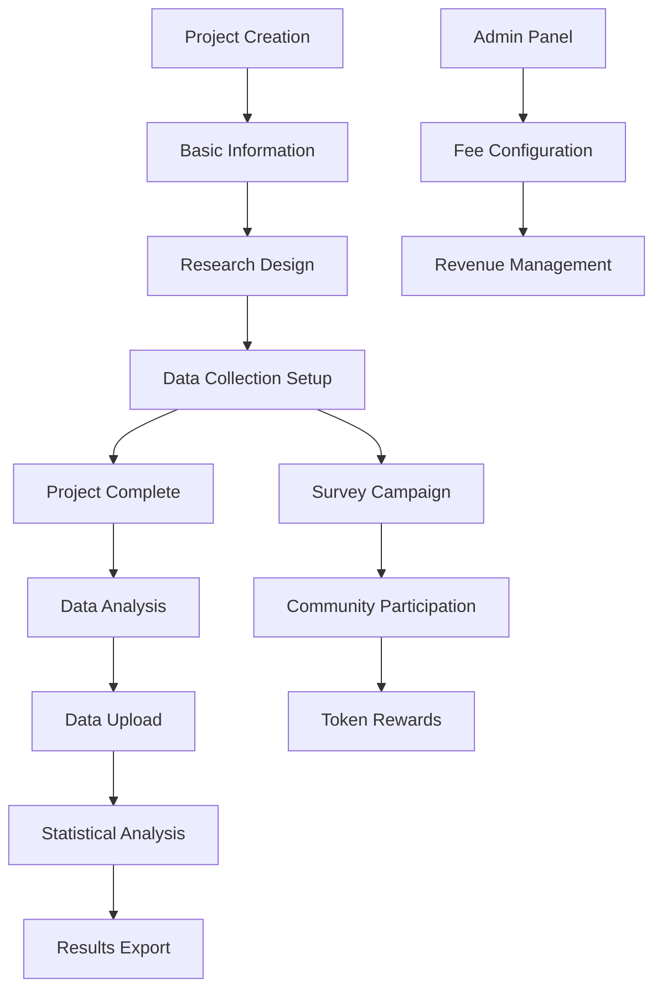
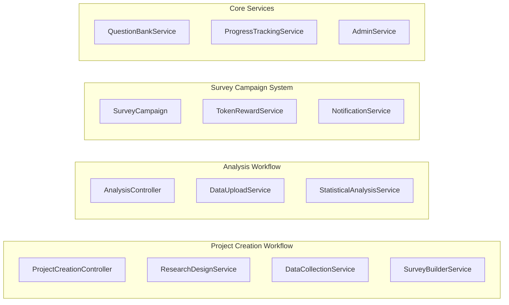

# Design Document - NCSKit Workflow Restructure

## Overview

This design outlines the restructuring of NCSKit's research workflow to move Research Design and Data Collection from the Analysis section into Project Creation, while simplifying the Analysis workflow to focus solely on data upload and statistical computation. The new architecture introduces an intelligent survey builder, token-based reward system, and comprehensive project progress tracking.

## Architecture

### High-Level Workflow Architecture



### Component Architecture



## Components and Interfaces

### 1. Enhanced Project Creation Workflow

#### ProjectCreationPage Component
- **Location**: `frontend/src/app/(dashboard)/projects/new/page.tsx`
- **Functionality**: 3-step wizard (Basic Info → Research Design → Data Collection)
- **State Management**: Multi-step form with progress tracking
- **Integration**: Connects to existing MarketingProjectForm

#### ResearchDesignStep Component
- **Location**: `frontend/src/components/projects/research-design-step.tsx`
- **Functionality**: 
  - Select theoretical frameworks and models
  - Define research variables
  - Configure hypotheses
  - Integration with existing research design logic

#### DataCollectionStep Component
- **Location**: `frontend/src/components/projects/data-collection-step.tsx`
- **Functionality**:
  - Auto-generate survey from research design
  - Customize survey questions
  - Configure survey campaigns
  - Set token rewards

### 2. Intelligent Survey Builder System

#### SurveyBuilderService
```typescript
interface SurveyBuilderService {
  generateSurveyFromResearchDesign(researchDesign: ResearchDesign): Survey
  getQuestionTemplates(modelType: string, variables: string[]): QuestionTemplate[]
  customizeSurvey(survey: Survey, customizations: SurveyCustomization[]): Survey
  validateSurvey(survey: Survey): ValidationResult
}
```

#### QuestionBankService
```typescript
interface QuestionBankService {
  getQuestionsByModel(modelId: string): QuestionTemplate[]
  getQuestionsByVariable(variableId: string): QuestionTemplate[]
  searchQuestions(criteria: SearchCriteria): QuestionTemplate[]
  createCustomQuestion(template: QuestionTemplate): QuestionTemplate
}
```

### 3. Survey Campaign System

#### SurveyCampaignService
```typescript
interface SurveyCampaignService {
  createCampaign(survey: Survey, config: CampaignConfig): SurveyCampaign
  launchCampaign(campaignId: string): void
  trackParticipation(campaignId: string): ParticipationStats
  processCampaignCompletion(campaignId: string): void
}
```

#### TokenRewardSystem
```typescript
interface TokenRewardService {
  calculateReward(survey: Survey, participantId: string): number
  processReward(participantId: string, amount: number, campaignId: string): void
  deductAdminFee(totalReward: number, feePercentage: number): FeeCalculation
  trackRevenueMetrics(campaignId: string): RevenueMetrics
}
```

### 4. Simplified Analysis Workflow

#### Enhanced DataUpload Component
- **Dual Mode Support**: Survey Results vs External Files
- **Project Integration**: Auto-detect available survey data
- **Smart Loading**: Context-aware data loading

#### Streamlined Analysis Flow
- Remove Research Design and Data Collection components
- Focus on: Upload → Preview → Analysis → Results
- Maintain existing statistical analysis capabilities

### 5. Project Progress Tracking System

#### ProgressTrackingService
```typescript
interface ProgressTrackingService {
  updateProjectStage(projectId: string, stage: ProjectStage): void
  getProjectProgress(projectId: string): ProjectProgress
  trackMilestone(projectId: string, milestone: Milestone): void
  generateProgressReport(projectId: string): ProgressReport
}

enum ProjectStage {
  IDEA_COMPLETE = 'idea_complete',
  THEORETICAL_FRAMEWORK_COMPLETE = 'theoretical_framework_complete',
  SURVEY_COMPLETE = 'survey_complete',
  DATA_COLLECTION_COMPLETE = 'data_collection_complete',
  ANALYSIS_COMPLETE = 'analysis_complete',
  DRAFT_COMPLETE = 'draft_complete',
  CITATION_COMPLETE = 'citation_complete',
  FORMAT_COMPLETE = 'format_complete',
  PLAGIARISM_CHECK_COMPLETE = 'plagiarism_check_complete',
  SUBMITTED = 'submitted',
  PUBLISHED = 'published'
}
```

## Data Models

### Enhanced Project Model
```typescript
interface Project {
  id: string
  title: string
  description: string
  
  // Research Design Data
  researchDesign: {
    theoreticalFrameworks: TheoreticalFramework[]
    researchVariables: ResearchVariable[]
    hypotheses: Hypothesis[]
    methodology: string
  }
  
  // Data Collection Data
  dataCollection: {
    surveyId?: string
    campaignId?: string
    targetSampleSize: number
    collectionMethod: 'internal_survey' | 'external_data'
    status: 'not_started' | 'active' | 'completed'
  }
  
  // Progress Tracking
  progress: {
    currentStage: ProjectStage
    completedMilestones: Milestone[]
    timeline: TimelineEvent[]
  }
  
  // Publication Tracking
  publication?: {
    submissionStatus?: 'draft' | 'submitted' | 'under_review' | 'accepted' | 'published'
    submissionDate?: Date
    publicationLink?: string
    journal?: string
  }
}
```

### Survey Campaign Model
```typescript
interface SurveyCampaign {
  id: string
  projectId: string
  surveyId: string
  
  // Campaign Configuration
  config: {
    targetParticipants: number
    tokenRewardPerParticipant: number
    duration: number // days
    eligibilityCriteria: EligibilityCriteria
  }
  
  // Campaign Status
  status: 'draft' | 'active' | 'paused' | 'completed' | 'cancelled'
  
  // Participation Tracking
  participation: {
    totalParticipants: number
    completedResponses: number
    totalTokensAwarded: number
    adminFeeCollected: number
  }
  
  // Timeline
  createdAt: Date
  launchedAt?: Date
  completedAt?: Date
}
```

### Question Bank Model
```typescript
interface QuestionTemplate {
  id: string
  text: string
  type: 'likert' | 'multiple_choice' | 'text' | 'numeric'
  
  // Model Association
  theoreticalModel: string
  researchVariable: string
  construct: string
  
  // Question Configuration
  options?: string[] // for multiple choice
  scale?: { min: number, max: number, labels: string[] } // for likert
  validation?: ValidationRule[]
  
  // Metadata
  source: string // academic source/reference
  reliability: number // Cronbach's alpha if available
  tags: string[]
}
```

## Error Handling

### Survey Builder Error Handling
- **Missing Question Templates**: Fallback to generic questions with user customization prompts
- **Invalid Research Design**: Validation with specific error messages and suggestions
- **Survey Generation Failures**: Graceful degradation with manual survey builder option

### Campaign Management Error Handling
- **Insufficient Tokens**: Pre-validation and user notification with funding options
- **Participant Eligibility**: Clear criteria display and automatic filtering
- **Reward Processing Failures**: Retry mechanism with manual intervention fallback

### Data Integration Error Handling
- **Survey Data Loading**: Robust error handling with data recovery options
- **External File Processing**: Comprehensive validation with detailed error reporting
- **Analysis Pipeline**: Graceful failure handling with partial result preservation

## Testing Strategy

### Unit Testing
- **Survey Builder Logic**: Test question generation algorithms and customization features
- **Token Reward Calculations**: Verify reward distribution and fee calculation accuracy
- **Progress Tracking**: Test milestone updates and progress calculation logic
- **Data Upload Processing**: Test file parsing and validation for various formats

### Integration Testing
- **Workflow Transitions**: Test seamless flow between project creation steps
- **Survey Campaign Lifecycle**: End-to-end campaign creation, execution, and completion
- **Data Analysis Integration**: Test survey data loading into analysis pipeline
- **Admin Fee Processing**: Test revenue calculation and collection mechanisms

### User Acceptance Testing
- **Project Creation Flow**: Validate user experience through complete project setup
- **Survey Participation**: Test community member survey participation experience
- **Analysis Workflow**: Verify simplified analysis workflow meets user needs
- **Progress Tracking**: Validate milestone tracking and progress visualization

## Performance Considerations

### Survey Builder Optimization
- **Question Template Caching**: Cache frequently used question templates
- **Lazy Loading**: Load question banks on-demand based on selected models
- **Batch Processing**: Optimize survey generation for large variable sets

### Campaign Management Scalability
- **Notification Batching**: Batch campaign notifications to prevent system overload
- **Reward Processing**: Asynchronous token reward processing with queue management
- **Participation Tracking**: Efficient real-time participation statistics

### Data Analysis Performance
- **Survey Data Caching**: Cache processed survey data for repeated analysis
- **Streaming Upload**: Support large file uploads with progress tracking
- **Analysis Pipeline**: Optimize statistical computation for large datasets

## Security Considerations

### Survey Data Protection
- **Participant Anonymity**: Ensure survey responses cannot be traced to individuals
- **Data Encryption**: Encrypt sensitive survey data at rest and in transit
- **Access Controls**: Implement role-based access to survey data and results

### Token System Security
- **Reward Validation**: Prevent duplicate reward claims and fraudulent participation
- **Fee Calculation**: Secure admin fee calculation and collection processes
- **Audit Trail**: Maintain comprehensive audit logs for all token transactions

### Campaign Management Security
- **Campaign Authorization**: Ensure only project owners can manage their campaigns
- **Participant Verification**: Verify participant eligibility and prevent abuse
- **Data Integrity**: Protect campaign data from unauthorized modifications

## Migration Strategy

### Phase 1: Component Restructuring
1. Move existing ResearchDesign and DataCollection components to projects folder
2. Update import paths and component references
3. Modify project creation page to include new workflow steps
4. Test existing functionality in new locations

### Phase 2: Survey Builder Implementation
1. Create QuestionBankService with initial question templates
2. Implement SurveyBuilderService with basic generation logic
3. Integrate survey builder into DataCollectionStep component
4. Add survey customization interface

### Phase 3: Campaign System Development
1. Implement SurveyCampaignService and related models
2. Create campaign management interface
3. Integrate TokenRewardService with existing token system
4. Add admin fee configuration and tracking

### Phase 4: Analysis Workflow Simplification
1. Remove research design and data collection from analysis page
2. Enhance DataUpload component with dual-mode support
3. Update analysis workflow navigation and progress indicators
4. Test end-to-end data flow from surveys to analysis

### Phase 5: Progress Tracking Integration
1. Implement ProgressTrackingService with milestone definitions
2. Add progress tracking to project interfaces
3. Create progress visualization components
4. Integrate publication tracking features

## Deployment Considerations

### Database Schema Updates
- Add survey campaign tables and relationships
- Extend project model with new fields for research design and data collection
- Create question bank tables with proper indexing
- Add progress tracking and milestone tables

### API Endpoint Changes
- Create new endpoints for survey builder and campaign management
- Update existing project endpoints to support new workflow
- Modify analysis endpoints to handle survey data loading
- Add admin endpoints for fee configuration and revenue tracking

### Frontend Build Optimization
- Code splitting for survey builder components
- Lazy loading for question bank data
- Optimize bundle size for enhanced project creation workflow
- Progressive loading for large survey datasets