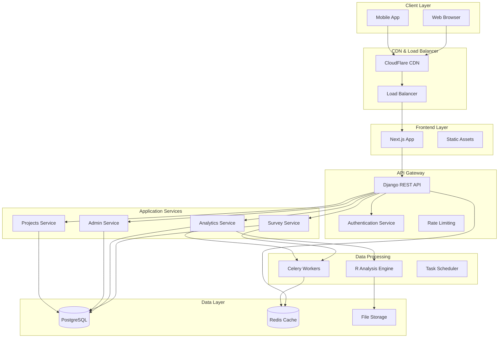
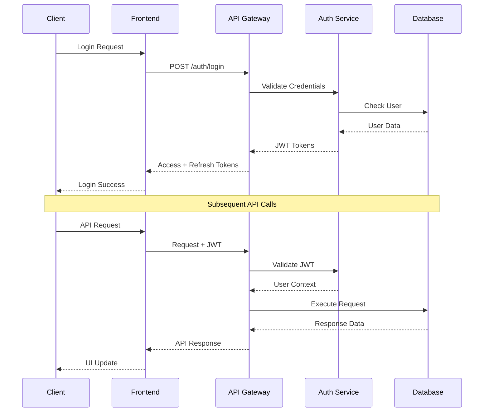
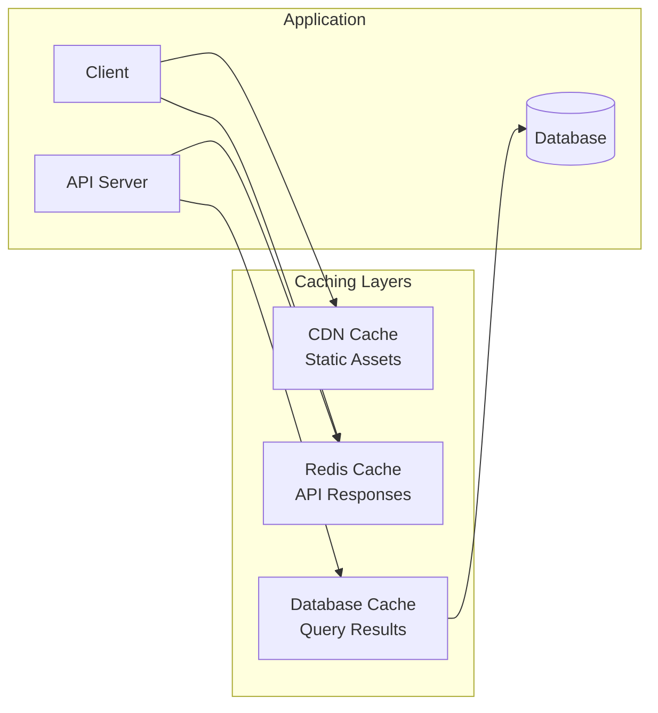
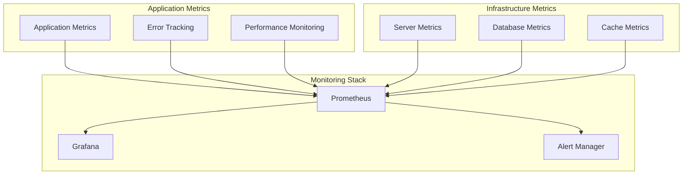
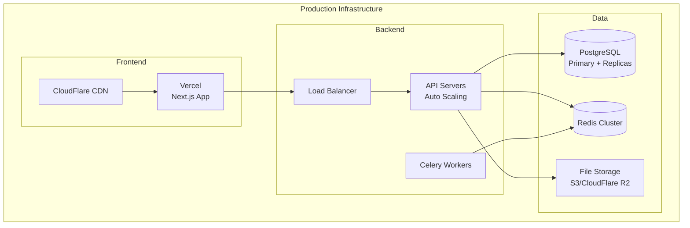
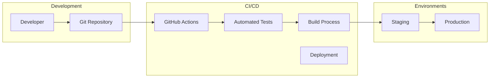
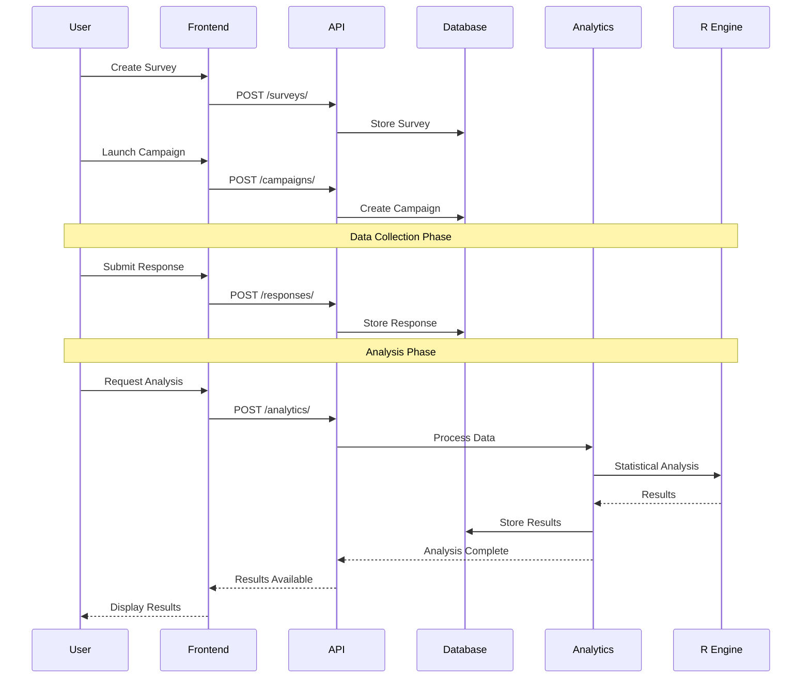
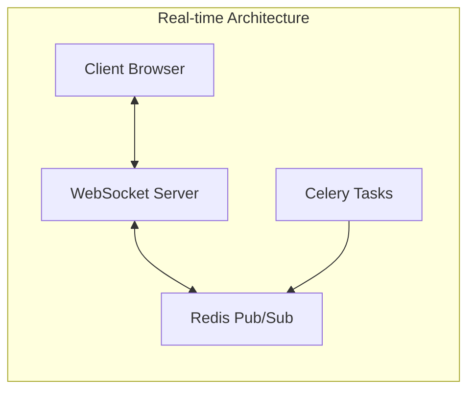

# NCSKIT System Architecture

## 🏗️ Tổng quan kiến trúc

NCSKIT được thiết kế theo kiến trúc microservices với frontend và backend tách biệt, đảm bảo khả năng mở rộng và bảo trì cao.

## 🎯 Kiến trúc tổng thể



## 🔧 Chi tiết các thành phần

### Frontend Layer

#### Next.js Application
- **Framework**: Next.js 16 với App Router
- **Language**: TypeScript cho type safety
- **Styling**: Tailwind CSS + Radix UI components
- **State Management**: Zustand cho global state
- **Data Fetching**: SWR cho caching và revalidation

```typescript
// Cấu trúc thư mục frontend
src/
├── app/                    # App Router pages
│   ├── (dashboard)/       # Dashboard layout group
│   ├── (auth)/           # Authentication pages
│   └── globals.css       # Global styles
├── components/            # Reusable components
│   ├── ui/               # Base UI components
│   ├── analytics/        # Analytics components
│   ├── surveys/          # Survey components
│   └── admin/            # Admin components
├── services/             # API services
├── hooks/                # Custom React hooks
├── types/                # TypeScript definitions
└── utils/                # Utility functions
```

### Backend Layer

#### Django REST Framework
- **Framework**: Django 5.0 với DRF
- **Database**: PostgreSQL với connection pooling
- **Authentication**: JWT với refresh tokens
- **API Documentation**: OpenAPI/Swagger
- **Background Tasks**: Celery với Redis broker

```python
# Cấu trúc thư mục backend
apps/
├── authentication/       # User authentication
├── surveys/             # Survey management
├── analytics/           # Data analysis
├── admin_management/    # Admin functionality
├── projects/            # Project management
└── question_bank/       # Question templates

ncskit_backend/
├── settings/            # Environment-specific settings
├── urls.py             # URL routing
└── wsgi.py             # WSGI application
```

### Data Processing Layer

#### R Analysis Engine
- **Statistical Computing**: R 4.3+ với specialized packages
- **Integration**: rpy2 cho Python-R communication
- **Packages**: lavaan, psych, semTools, ggplot2
- **Output**: JSON serialized results

```r
# R packages được sử dụng
required_packages <- c(
  "lavaan",      # SEM analysis
  "psych",       # Psychometric analysis
  "semTools",    # SEM utilities
  "ggplot2",     # Visualization
  "dplyr",       # Data manipulation
  "tidyr",       # Data tidying
  "corrplot",    # Correlation plots
  "VIM"          # Missing data visualization
)
```

#### Celery Task Queue
- **Broker**: Redis cho message passing
- **Workers**: Multiple workers cho parallel processing
- **Monitoring**: Flower cho task monitoring
- **Scheduling**: Celery Beat cho scheduled tasks

### Data Layer

#### PostgreSQL Database
```sql
-- Core tables structure
Users                    -- User management
Projects                 -- Research projects
Surveys                  -- Survey definitions
Campaigns               -- Survey campaigns
Responses               -- Survey responses
AnalysisProjects        -- Analysis projects
AnalysisResults         -- Analysis results
StatisticalValidations  -- Validation results
```

#### Redis Cache
- **Session Storage**: User sessions
- **API Caching**: Response caching
- **Task Queue**: Celery message broker
- **Real-time Data**: WebSocket connections

## 🔐 Security Architecture

### Authentication & Authorization


### Data Security
- **Encryption at Rest**: Database encryption
- **Encryption in Transit**: TLS 1.3 cho tất cả connections
- **Data Anonymization**: PII masking trong analytics
- **Audit Logging**: Comprehensive activity tracking
- **GDPR Compliance**: Data retention policies

## 📊 Performance Architecture

### Caching Strategy


### Load Balancing
- **Frontend**: Vercel Edge Network
- **Backend**: Application Load Balancer
- **Database**: Read replicas cho read-heavy operations
- **File Storage**: CDN distribution

### Monitoring & Observability


## 🚀 Deployment Architecture

### Production Environment


### CI/CD Pipeline


## 🔄 Data Flow Architecture

### Survey Data Flow


### Real-time Updates


## 📈 Scalability Considerations

### Horizontal Scaling
- **Frontend**: Edge deployment với Vercel
- **Backend**: Auto-scaling API servers
- **Database**: Read replicas và sharding
- **Cache**: Redis cluster mode
- **Workers**: Dynamic worker scaling

### Performance Optimization
- **Database Indexing**: Optimized queries
- **Connection Pooling**: Efficient database connections
- **Lazy Loading**: Component-level code splitting
- **Image Optimization**: Next.js Image component
- **API Pagination**: Efficient data loading

### Resource Management
- **Memory**: Efficient data structures
- **CPU**: Optimized algorithms
- **Storage**: Compressed data storage
- **Network**: Minimized payload sizes

## 🛡️ Disaster Recovery

### Backup Strategy
- **Database**: Daily automated backups
- **Files**: Replicated storage
- **Code**: Git repository backups
- **Configuration**: Infrastructure as Code

### Recovery Procedures
- **RTO**: Recovery Time Objective < 4 hours
- **RPO**: Recovery Point Objective < 1 hour
- **Failover**: Automated failover procedures
- **Testing**: Regular disaster recovery drills

---

*Tài liệu này được cập nhật thường xuyên để phản ánh các thay đổi trong kiến trúc hệ thống.*