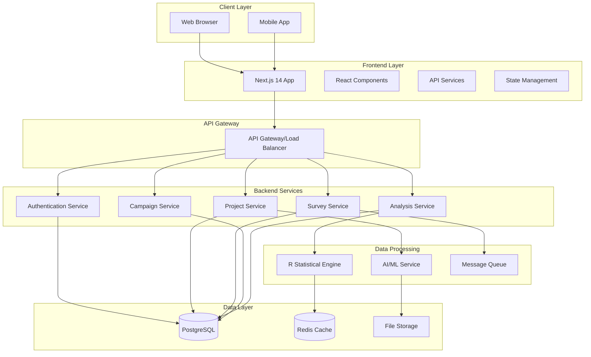
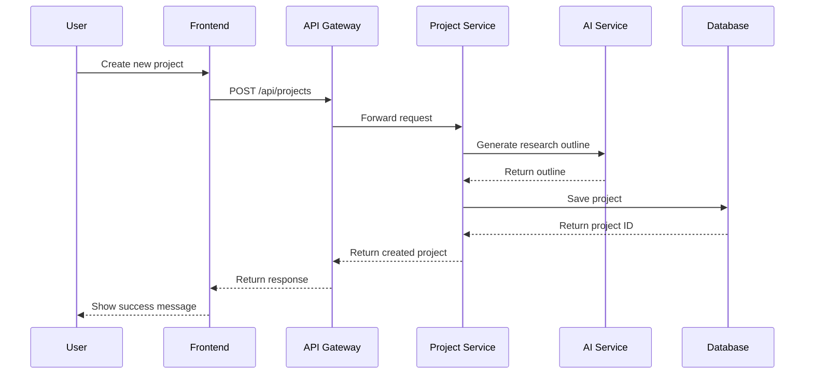
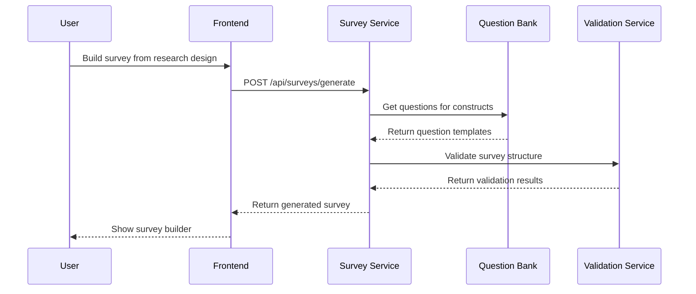
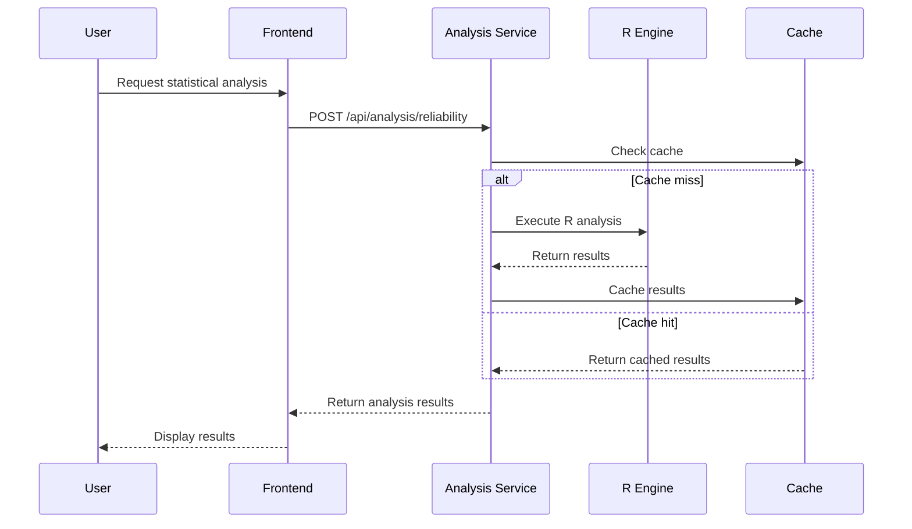

# Kiến trúc Hệ thống NCSKit

## 🏗️ Tổng quan Kiến trúc

NCSKit được thiết kế theo kiến trúc microservices với các thành phần độc lập, có thể mở rộng và bảo trì dễ dàng.



## 🎯 Các Thành phần Chính

### 1. Frontend Layer (Next.js 14)

#### App Router Structure
```
src/app/
├── (auth)/                 # Authentication routes
│   ├── login/
│   ├── register/
│   └── forgot-password/
├── (dashboard)/            # Protected dashboard routes
│   ├── projects/
│   ├── surveys/
│   ├── campaigns/
│   ├── analysis/
│   └── admin/
├── blog/                   # Public blog
├── api/                    # API routes
└── globals.css
```

#### Component Architecture
```
src/components/
├── ui/                     # Base UI components
│   ├── button.tsx
│   ├── input.tsx
│   ├── card.tsx
│   └── error-message.tsx
├── layout/                 # Layout components
│   ├── header.tsx
│   ├── sidebar.tsx
│   └── footer.tsx
├── projects/               # Project-specific components
├── surveys/                # Survey-specific components
├── analysis/               # Analysis components
└── error-boundary/         # Error handling
```

#### State Management
```typescript
// Zustand stores
src/store/
├── auth.ts                 # Authentication state
├── projects.ts             # Project state
├── surveys.ts              # Survey state
└── ui.ts                   # UI state
```

### 2. Backend Services (Django)

#### Service Architecture
```
backend/
├── apps/
│   ├── authentication/     # User management
│   │   ├── models.py
│   │   ├── views.py
│   │   ├── serializers.py
│   │   └── urls.py
│   ├── projects/          # Project management
│   ├── surveys/           # Survey management
│   ├── campaigns/         # Campaign management
│   └── analysis/          # Data analysis
├── core/                  # Shared utilities
├── config/                # Configuration
└── requirements.txt
```

#### API Design Patterns
```python
# RESTful API with DRF
class ProjectViewSet(viewsets.ModelViewSet):
    queryset = Project.objects.all()
    serializer_class = ProjectSerializer
    permission_classes = [IsAuthenticated]
    
    @action(detail=True, methods=['post'])
    def generate_outline(self, request, pk=None):
        # AI-powered outline generation
        pass
```

### 3. R Statistical Engine

#### R Server Architecture
```r
# plumber.R - R API Server
library(plumber)
library(jsonlite)

#* @apiTitle NCSKit Statistical Analysis API
#* @apiDescription Advanced statistical analysis endpoints

#* Reliability Analysis
#* @param data:list Data matrix
#* @param scales:list Scale definitions
#* @post /analysis/reliability
function(data, scales) {
    # Cronbach's Alpha calculation
    library(psych)
    results <- list()
    
    for(scale_name in names(scales)) {
        scale_items <- scales[[scale_name]]
        scale_data <- data[, scale_items, drop = FALSE]
        alpha_result <- alpha(scale_data)
        results[[scale_name]] <- alpha_result
    }
    
    return(results)
}
```

#### Statistical Capabilities
- **Descriptive Statistics**: Mean, SD, Correlation
- **Reliability Analysis**: Cronbach's Alpha, McDonald's Omega
- **Factor Analysis**: EFA, CFA with lavaan
- **SEM**: Structural Equation Modeling
- **Advanced Tests**: ANOVA, Regression, T-tests

### 4. Database Design

#### Core Tables
```sql
-- Users and Authentication
CREATE TABLE users (
    id UUID PRIMARY KEY DEFAULT gen_random_uuid(),
    email VARCHAR(255) UNIQUE NOT NULL,
    password_hash VARCHAR(255) NOT NULL,
    name VARCHAR(255) NOT NULL,
    role VARCHAR(50) DEFAULT 'researcher',
    created_at TIMESTAMP DEFAULT NOW(),
    updated_at TIMESTAMP DEFAULT NOW()
);

-- Projects
CREATE TABLE projects (
    id UUID PRIMARY KEY DEFAULT gen_random_uuid(),
    title VARCHAR(500) NOT NULL,
    description TEXT,
    user_id UUID REFERENCES users(id),
    business_domain_id INTEGER,
    selected_models INTEGER[],
    research_outline JSONB,
    status VARCHAR(50) DEFAULT 'draft',
    progress INTEGER DEFAULT 0,
    created_at TIMESTAMP DEFAULT NOW(),
    updated_at TIMESTAMP DEFAULT NOW()
);

-- Surveys
CREATE TABLE surveys (
    id UUID PRIMARY KEY DEFAULT gen_random_uuid(),
    project_id UUID REFERENCES projects(id),
    title VARCHAR(500) NOT NULL,
    description TEXT,
    questions JSONB NOT NULL,
    settings JSONB DEFAULT '{}',
    status VARCHAR(50) DEFAULT 'draft',
    created_at TIMESTAMP DEFAULT NOW(),
    updated_at TIMESTAMP DEFAULT NOW()
);

-- Survey Campaigns
CREATE TABLE survey_campaigns (
    id UUID PRIMARY KEY DEFAULT gen_random_uuid(),
    survey_id UUID REFERENCES surveys(id),
    title VARCHAR(500) NOT NULL,
    target_participants INTEGER NOT NULL,
    token_reward_per_participant INTEGER DEFAULT 0,
    eligibility_criteria JSONB DEFAULT '{}',
    status VARCHAR(50) DEFAULT 'draft',
    launched_at TIMESTAMP,
    completed_at TIMESTAMP,
    created_at TIMESTAMP DEFAULT NOW(),
    updated_at TIMESTAMP DEFAULT NOW()
);

-- Question Bank
CREATE TABLE question_templates (
    id UUID PRIMARY KEY DEFAULT gen_random_uuid(),
    text TEXT NOT NULL,
    text_vi TEXT,
    type VARCHAR(50) NOT NULL,
    category VARCHAR(100),
    construct VARCHAR(100),
    model_framework VARCHAR(100),
    options JSONB,
    scale JSONB,
    reliability_score DECIMAL(3,2),
    usage_count INTEGER DEFAULT 0,
    created_at TIMESTAMP DEFAULT NOW()
);
```

#### Indexing Strategy
```sql
-- Performance indexes
CREATE INDEX idx_projects_user_id ON projects(user_id);
CREATE INDEX idx_projects_status ON projects(status);
CREATE INDEX idx_surveys_project_id ON surveys(project_id);
CREATE INDEX idx_campaigns_survey_id ON survey_campaigns(survey_id);
CREATE INDEX idx_questions_construct ON question_templates(construct);
CREATE INDEX idx_questions_model ON question_templates(model_framework);

-- Full-text search
CREATE INDEX idx_projects_search ON projects USING gin(to_tsvector('english', title || ' ' || description));
CREATE INDEX idx_questions_search ON question_templates USING gin(to_tsvector('english', text));
```

## 🔄 Data Flow

### 1. Project Creation Flow


### 2. Survey Building Flow


### 3. Data Analysis Flow


## 🛡️ Security Architecture

### Authentication & Authorization
```typescript
// JWT-based authentication
interface JWTPayload {
    userId: string;
    email: string;
    role: 'admin' | 'researcher' | 'participant';
    permissions: string[];
    exp: number;
}

// Role-based access control
const permissions = {
    admin: ['*'],
    researcher: [
        'projects:read',
        'projects:write',
        'surveys:read',
        'surveys:write',
        'campaigns:read',
        'campaigns:write',
        'analysis:read',
        'analysis:write'
    ],
    participant: [
        'surveys:respond',
        'profile:read',
        'profile:write'
    ]
};
```

### Data Protection
- **Encryption at Rest**: AES-256 for sensitive data
- **Encryption in Transit**: TLS 1.3 for all communications
- **Input Validation**: Comprehensive validation on all inputs
- **SQL Injection Prevention**: Parameterized queries
- **XSS Protection**: Content Security Policy headers
- **CSRF Protection**: CSRF tokens for state-changing operations

## 📈 Performance & Scalability

### Caching Strategy
```typescript
// Multi-layer caching
interface CacheStrategy {
    browser: {
        static: '1 year',
        api: '5 minutes',
        user_data: 'no-cache'
    };
    cdn: {
        static_assets: '1 year',
        api_responses: '1 hour'
    };
    redis: {
        session_data: '24 hours',
        analysis_results: '1 week',
        question_bank: '1 day'
    };
}
```

### Database Optimization
- **Connection Pooling**: PgBouncer for connection management
- **Read Replicas**: Separate read/write operations
- **Partitioning**: Time-based partitioning for large tables
- **Materialized Views**: Pre-computed aggregations

### Monitoring & Observability
```typescript
// Application metrics
interface Metrics {
    performance: {
        response_time: 'p95 < 200ms',
        throughput: '1000 req/s',
        error_rate: '< 0.1%'
    };
    business: {
        active_users: 'daily/monthly',
        project_creation_rate: 'per day',
        survey_completion_rate: 'percentage',
        analysis_success_rate: 'percentage'
    };
}
```

## 🔧 Development & Deployment

### CI/CD Pipeline
```yaml
# .github/workflows/deploy.yml
name: Deploy NCSKit
on:
  push:
    branches: [main]

jobs:
  test:
    runs-on: ubuntu-latest
    steps:
      - uses: actions/checkout@v3
      - name: Run tests
        run: |
          npm test
          python -m pytest
          
  build:
    needs: test
    runs-on: ubuntu-latest
    steps:
      - name: Build Docker images
        run: |
          docker build -t ncskit/frontend ./frontend
          docker build -t ncskit/backend ./backend
          
  deploy:
    needs: build
    runs-on: ubuntu-latest
    steps:
      - name: Deploy to production
        run: |
          kubectl apply -f k8s/
```

### Infrastructure as Code
```yaml
# docker-compose.yml
version: '3.8'
services:
  frontend:
    build: ./frontend
    ports:
      - "3000:3000"
    environment:
      - NEXT_PUBLIC_API_URL=http://backend:8000
      
  backend:
    build: ./backend
    ports:
      - "8000:8000"
    environment:
      - DATABASE_URL=postgresql://user:pass@db:5432/ncskit
      
  r-engine:
    build: ./backend/r_analysis
    ports:
      - "8001:8000"
      
  db:
    image: postgres:15
    environment:
      - POSTGRES_DB=ncskit
      - POSTGRES_USER=user
      - POSTGRES_PASSWORD=pass
    volumes:
      - postgres_data:/var/lib/postgresql/data
      
  redis:
    image: redis:7-alpine
    ports:
      - "6379:6379"
```

## 🎯 Future Architecture Considerations

### Microservices Evolution
- **Service Mesh**: Istio for service-to-service communication
- **Event Sourcing**: CQRS pattern for complex business logic
- **GraphQL Federation**: Unified API layer
- **Serverless Functions**: Edge computing for analysis tasks

### AI/ML Integration
- **Model Serving**: TensorFlow Serving for ML models
- **Feature Store**: Centralized feature management
- **MLOps Pipeline**: Automated model training and deployment
- **Real-time Inference**: Streaming analytics

---

Kiến trúc này đảm bảo NCSKit có thể mở rộng từ hàng nghìn đến hàng triệu người dùng với hiệu suất cao và độ tin cậy tối đa.